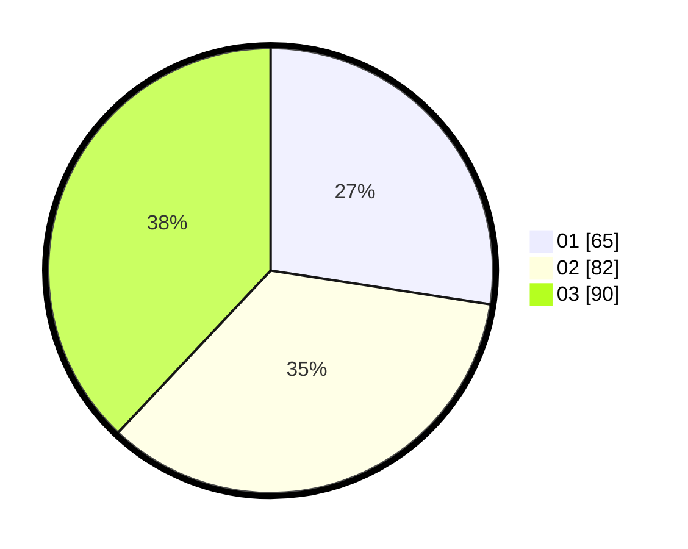

# Hasil

Hasil perolehan suara paslon dapat dilihat pada file paslon-01.txt, paslon-02.txt, dan paslon-03.txt.

Jika tidak ada, artinya data tersebut belum ada pada SIREKAP.

## Perolehan Suara

 * Paslon 01: **65**.
 * Paslon 02: **82**.
 * Paslon 03: **90**.

## Foto C Plano

https://sirekap-obj-formc.kpu.go.id/9ab6/pemilu/ppwp/31/73/02/10/01/3173021001028-20240214-155047--1eeb75a1-48a6-4a83-b848-cd4e88851bb5.jpg

https://sirekap-obj-formc.kpu.go.id/9ab6/pemilu/ppwp/31/73/02/10/01/3173021001028-20240214-232754--2cbe1154-3025-4d77-bc07-83c2159bbdcc.jpg

https://sirekap-obj-formc.kpu.go.id/9ab6/pemilu/ppwp/31/73/02/10/01/3173021001028-20240214-232846--57187d31-47ef-419c-838b-ee8e071852ec.jpg

## DATA PEMILIH TETAP

Jumlah pemilih dalam DPT: **280**.
 * L: **129**.
 * P: **151**.

## DATA PENGGUNA HAK PILIH

Jumlah pengguna hak pilih dalam DPT: **218**.
 * L: **95**.
 * P: **123**.

Jumlah pengguna hak pilih dalam DPTb: **20**.
 * L: **2**.
 * P: **18**.

Jumlah pengguna hak pilih dalam DPK: **2**.
 * L: **1**.
 * P: **1**.

Jumlah pengguna hak pilih: **240**.
 * L: **98**.
 * P: **142**.

## JUMLAH SUARA SAH DAN TIDAK SAH

JUMLAH SELURUH SUARA SAH: **237**.

JUMLAH SUARA TIDAK SAH: **3**.

JUMLAH SELURUH SUARA SAH DAN SUARA TIDAK SAH: **240**.
