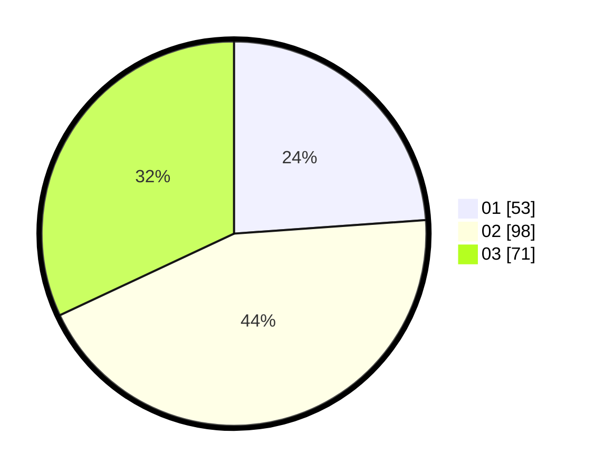

# Hasil

Hasil perolehan suara paslon dapat dilihat pada file paslon-01.txt, paslon-02.txt, dan paslon-03.txt.

Jika tidak ada, artinya data tersebut belum ada pada SIREKAP.

## Perolehan Suara

 * Paslon 01: **53**.
 * Paslon 02: **98**.
 * Paslon 03: **71**.

## Foto C Plano

https://sirekap-obj-formc.kpu.go.id/2eb4/pemilu/ppwp/31/73/02/10/01/3173021001031-20240214-190504--50049eae-805d-4c8a-9e70-8a7a72686f9a.jpg

https://sirekap-obj-formc.kpu.go.id/2eb4/pemilu/ppwp/31/73/02/10/01/3173021001031-20240214-185751--bb61a8b0-72c3-4956-b4ef-91c7b5e28fde.jpg

https://sirekap-obj-formc.kpu.go.id/2eb4/pemilu/ppwp/31/73/02/10/01/3173021001031-20240214-190549--1bd5a7da-6d2c-49df-a6d8-4d1d9029dc2a.jpg

## DATA PEMILIH TETAP

Jumlah pemilih dalam DPT: **261**.
 * L: **130**.
 * P: **131**.

## DATA PENGGUNA HAK PILIH

Jumlah pengguna hak pilih dalam DPT: **201**.
 * L: **98**.
 * P: **103**.

Jumlah pengguna hak pilih dalam DPTb: **18**.
 * L: **9**.
 * P: **9**.

Jumlah pengguna hak pilih dalam DPK: **6**.
 * L: **3**.
 * P: **3**.

Jumlah pengguna hak pilih: **225**.
 * L: **110**.
 * P: **115**.

## JUMLAH SUARA SAH DAN TIDAK SAH

JUMLAH SELURUH SUARA SAH: **222**.

JUMLAH SUARA TIDAK SAH: **3**.

JUMLAH SELURUH SUARA SAH DAN SUARA TIDAK SAH: **225**.
