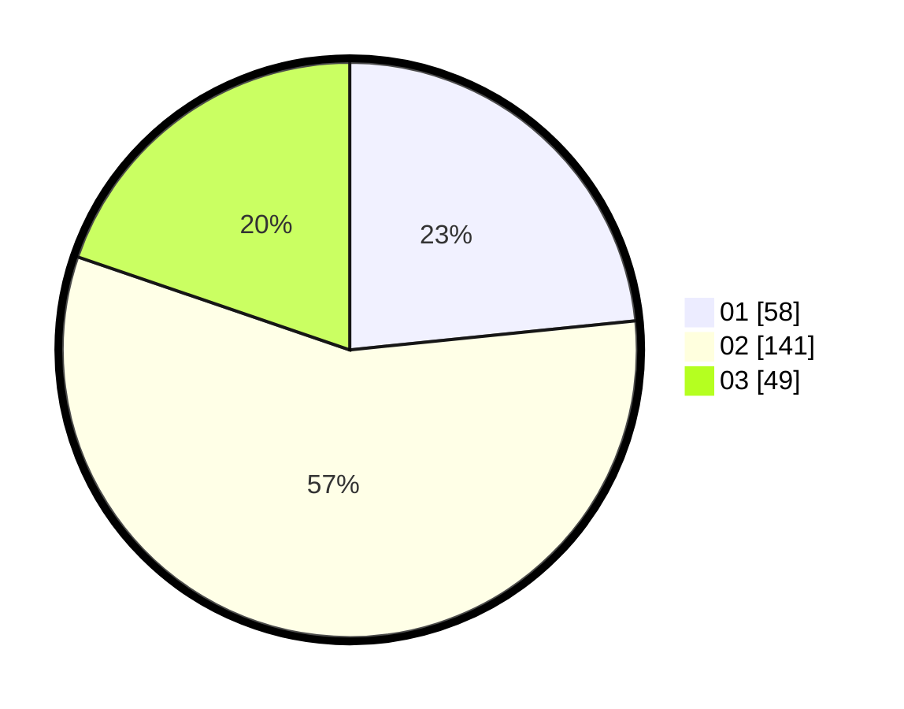

# Hasil

Hasil perolehan suara paslon dapat dilihat pada file paslon-01.txt, paslon-02.txt, dan paslon-03.txt.

Jika tidak ada, artinya data tersebut belum ada pada SIREKAP.

## Perolehan Suara

 * Paslon 01: **58**.
 * Paslon 02: **141**.
 * Paslon 03: **49**.

## Foto C Plano

https://sirekap-obj-formc.kpu.go.id/dd07/pemilu/ppwp/31/73/02/10/01/3173021001033-20240214-155027--cd00b784-bd8f-4290-94df-fd691a354e54.jpg

https://sirekap-obj-formc.kpu.go.id/dd07/pemilu/ppwp/31/73/02/10/01/3173021001033-20240214-175444--db7ac38b-e424-40c5-8356-21ebaa9b9231.jpg

https://sirekap-obj-formc.kpu.go.id/dd07/pemilu/ppwp/31/73/02/10/01/3173021001033-20240214-185205--93feb2b9-6cea-45a5-97b4-2b3bc28a8033.jpg

## DATA PEMILIH TETAP

Jumlah pemilih dalam DPT: **269**.
 * L: **136**.
 * P: **133**.

## DATA PENGGUNA HAK PILIH

Jumlah pengguna hak pilih dalam DPT: **216**.
 * L: **106**.
 * P: **110**.

Jumlah pengguna hak pilih dalam DPTb: **35**.
 * L: **16**.
 * P: **19**.

Jumlah pengguna hak pilih dalam DPK: **0**.
 * L: **0**.
 * P: **0**.

Jumlah pengguna hak pilih: **251**.
 * L: **122**.
 * P: **129**.

## JUMLAH SUARA SAH DAN TIDAK SAH

JUMLAH SELURUH SUARA SAH: **248**.

JUMLAH SUARA TIDAK SAH: **3**.

JUMLAH SELURUH SUARA SAH DAN SUARA TIDAK SAH: **251**.
