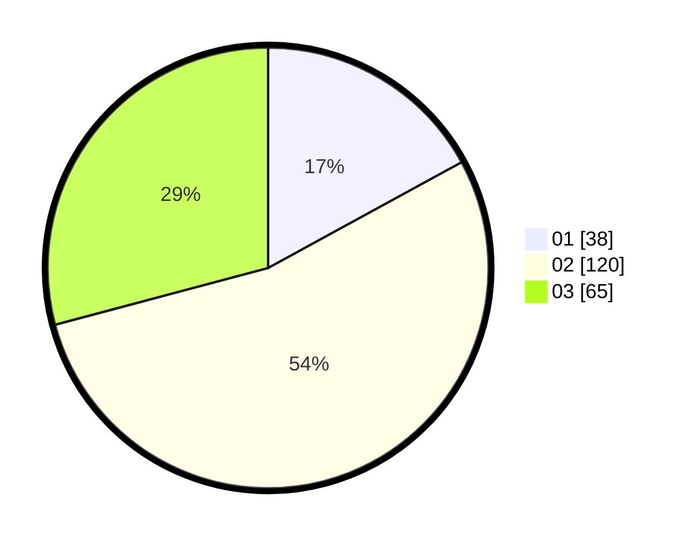

# Hasil

Hasil perolehan suara paslon dapat dilihat pada file paslon-01.txt, paslon-02.txt, dan paslon-03.txt.

Jika tidak ada, artinya data tersebut belum ada pada SIREKAP.

## Perolehan Suara

 * Paslon 01: **38**.
 * Paslon 02: **120**.
 * Paslon 03: **65**.

## Foto C Plano

https://sirekap-obj-formc.kpu.go.id/e82c/pemilu/ppwp/31/73/02/10/01/3173021001034-20240214-211125--3d9280b9-1720-449b-be34-7ebf13d05777.jpg

https://sirekap-obj-formc.kpu.go.id/e82c/pemilu/ppwp/31/73/02/10/01/3173021001034-20240214-211258--f03a94f4-f9dc-488a-911a-505dd0bb79e8.jpg

https://sirekap-obj-formc.kpu.go.id/e82c/pemilu/ppwp/31/73/02/10/01/3173021001034-20240214-200611--d2bb4907-c2ee-4b5f-b9c7-43404faee14f.jpg

## DATA PEMILIH TETAP

Jumlah pemilih dalam DPT: **286**.
 * L: **139**.
 * P: **147**.

## DATA PENGGUNA HAK PILIH

Jumlah pengguna hak pilih dalam DPT: **207**.
 * L: **101**.
 * P: **106**.

Jumlah pengguna hak pilih dalam DPTb: **22**.
 * L: **9**.
 * P: **13**.

Jumlah pengguna hak pilih dalam DPK: **1**.
 * L: **0**.
 * P: **1**.

Jumlah pengguna hak pilih: **230**.
 * L: **110**.
 * P: **120**.

## JUMLAH SUARA SAH DAN TIDAK SAH

JUMLAH SELURUH SUARA SAH: **223**.

JUMLAH SUARA TIDAK SAH: **7**.

JUMLAH SELURUH SUARA SAH DAN SUARA TIDAK SAH: **230**.
