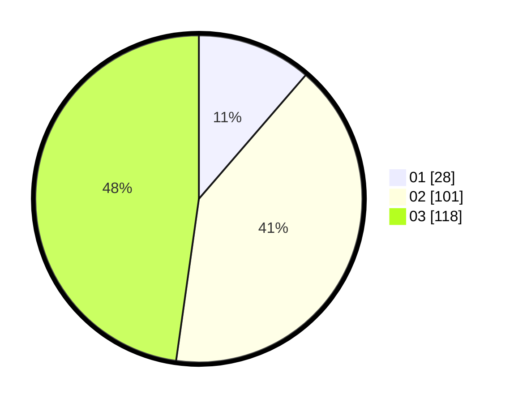

# Hasil

Hasil perolehan suara paslon dapat dilihat pada file paslon-01.txt, paslon-02.txt, dan paslon-03.txt.

Jika tidak ada, artinya data tersebut belum ada pada SIREKAP.

## Perolehan Suara

 * Paslon 01: **28**.
 * Paslon 02: **101**.
 * Paslon 03: **118**.

## Foto C Plano

https://sirekap-obj-formc.kpu.go.id/daf9/pemilu/ppwp/31/73/02/10/01/3173021001035-20240214-155242--3ff56802-9765-415f-b289-6064718cacb0.jpg

https://sirekap-obj-formc.kpu.go.id/daf9/pemilu/ppwp/31/73/02/10/01/3173021001035-20240214-155111--b2705d4e-9e0f-4141-852f-51db1f0e7e7a.jpg

https://sirekap-obj-formc.kpu.go.id/daf9/pemilu/ppwp/31/73/02/10/01/3173021001035-20240214-155337--2509179c-6ffc-49a6-a287-898f37275d23.jpg

## DATA PEMILIH TETAP

Jumlah pemilih dalam DPT: **284**.
 * L: **146**.
 * P: **138**.

## DATA PENGGUNA HAK PILIH

Jumlah pengguna hak pilih dalam DPT: **220**.
 * L: **115**.
 * P: **105**.

Jumlah pengguna hak pilih dalam DPTb: **29**.
 * L: **7**.
 * P: **22**.

Jumlah pengguna hak pilih dalam DPK: **2**.
 * L: **0**.
 * P: **2**.

Jumlah pengguna hak pilih: **251**.
 * L: **122**.
 * P: **129**.

## JUMLAH SUARA SAH DAN TIDAK SAH

JUMLAH SELURUH SUARA SAH: **247**.

JUMLAH SUARA TIDAK SAH: **4**.

JUMLAH SELURUH SUARA SAH DAN SUARA TIDAK SAH: **251**.
