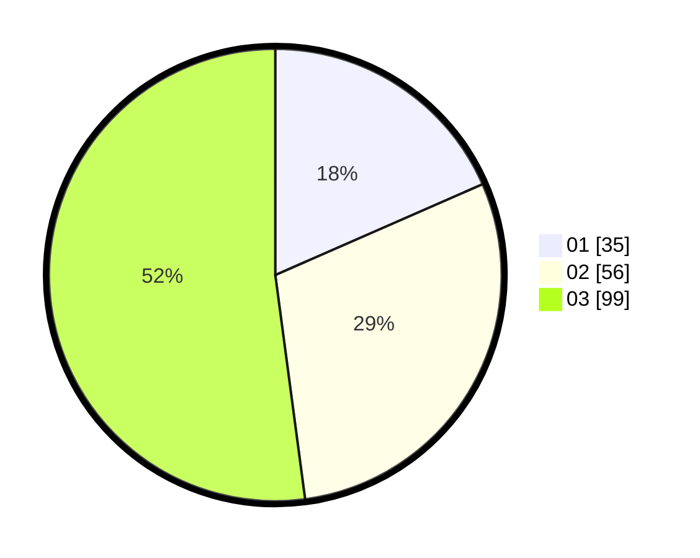

# Hasil

Hasil perolehan suara paslon dapat dilihat pada file paslon-01.txt, paslon-02.txt, dan paslon-03.txt.

Jika tidak ada, artinya data tersebut belum ada pada SIREKAP.

## Perolehan Suara

 * Paslon 01: **35**.
 * Paslon 02: **56**.
 * Paslon 03: **99**.

## Foto C Plano

https://sirekap-obj-formc.kpu.go.id/5966/pemilu/ppwp/31/73/02/10/01/3173021001042-20240214-205143--df1907a7-ad56-4979-9713-0dc35ac679f6.jpg

https://sirekap-obj-formc.kpu.go.id/5966/pemilu/ppwp/31/73/02/10/01/3173021001042-20240214-155840--35655903-9bf3-4349-8316-5a9a9a0cef04.jpg

https://sirekap-obj-formc.kpu.go.id/5966/pemilu/ppwp/31/73/02/10/01/3173021001042-20240214-155917--4fe71405-7d6d-4e3a-82d5-f49ebe4c96e9.jpg
