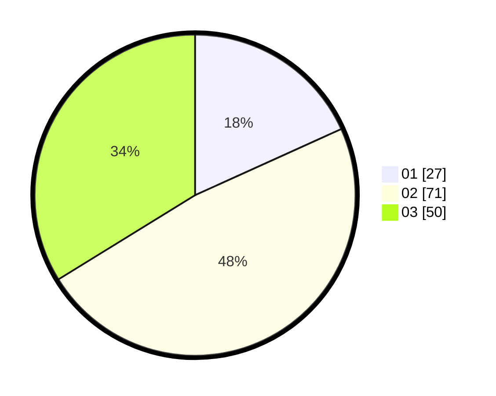

# Hasil

Hasil perolehan suara paslon dapat dilihat pada file paslon-01.txt, paslon-02.txt, dan paslon-03.txt.

Jika tidak ada, artinya data tersebut belum ada pada SIREKAP.

## Perolehan Suara

 * Paslon 01: **27**.
 * Paslon 02: **71**.
 * Paslon 03: **50**.

## Foto C Plano

https://sirekap-obj-formc.kpu.go.id/2a21/pemilu/ppwp/31/73/02/10/01/3173021001044-20240216-193845--4a992690-71b2-4cf6-b2fe-cb69bba3ada0.jpg

https://sirekap-obj-formc.kpu.go.id/2a21/pemilu/ppwp/31/73/02/10/01/3173021001044-20240216-194308--af189845-e6db-4bf8-96e6-065c853939e7.jpg

https://sirekap-obj-formc.kpu.go.id/2a21/pemilu/ppwp/31/73/02/10/01/3173021001044-20240216-195943--e87fb09a-3116-49fe-ab43-c076ebaf040c.jpg

## DATA PEMILIH TETAP

Jumlah pemilih dalam DPT: **216**.
 * L: **92**.
 * P: **125**.

## DATA PENGGUNA HAK PILIH

Jumlah pengguna hak pilih dalam DPT: **130**.
 * L: **52**.
 * P: **78**.

Jumlah pengguna hak pilih dalam DPTb: **10**.
 * L: **4**.
 * P: **6**.

Jumlah pengguna hak pilih dalam DPK: **8**.
 * L: **5**.
 * P: **3**.

Jumlah pengguna hak pilih: **148**.
 * L: **61**.
 * P: **87**.

## JUMLAH SUARA SAH DAN TIDAK SAH

JUMLAH SELURUH SUARA SAH: **148**.

JUMLAH SUARA TIDAK SAH: **0**.

JUMLAH SELURUH SUARA SAH DAN SUARA TIDAK SAH: **148**.
