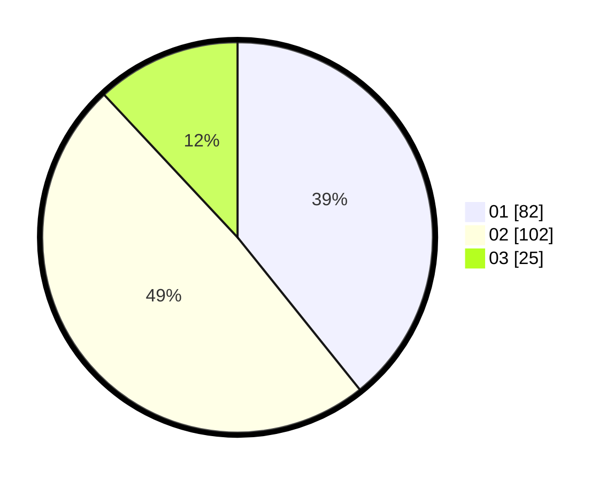

# Hasil

Hasil perolehan suara paslon dapat dilihat pada file paslon-01.txt, paslon-02.txt, dan paslon-03.txt.

Jika tidak ada, artinya data tersebut belum ada pada SIREKAP.

## Perolehan Suara

 * Paslon 01: **82**.
 * Paslon 02: **102**.
 * Paslon 03: **25**.

## Foto C Plano

https://sirekap-obj-formc.kpu.go.id/9e93/pemilu/ppwp/31/73/02/10/01/3173021001047-20240216-032326--ccfd9758-11bf-46af-8f0a-03b1fbeecdfb.jpg

https://sirekap-obj-formc.kpu.go.id/9e93/pemilu/ppwp/31/73/02/10/01/3173021001047-20240216-032332--703ac32b-512a-408a-9dff-67fc0eda8d25.jpg

https://sirekap-obj-formc.kpu.go.id/9e93/pemilu/ppwp/31/73/02/10/01/3173021001047-20240216-032331--a9eb95a4-41b0-4d83-94eb-977c0d6edef4.jpg

## DATA PEMILIH TETAP

Jumlah pemilih dalam DPT: **265**.
 * L: **131**.
 * P: **134**.

## DATA PENGGUNA HAK PILIH

Jumlah pengguna hak pilih dalam DPT: **208**.
 * L: **106**.
 * P: **102**.

Jumlah pengguna hak pilih dalam DPTb: **3**.
 * L: **2**.
 * P: **1**.

Jumlah pengguna hak pilih dalam DPK: **2**.
 * L: **2**.
 * P: **0**.

Jumlah pengguna hak pilih: **213**.
 * L: **110**.
 * P: **103**.

## JUMLAH SUARA SAH DAN TIDAK SAH

JUMLAH SELURUH SUARA SAH: **209**.

JUMLAH SUARA TIDAK SAH: **4**.

JUMLAH SELURUH SUARA SAH DAN SUARA TIDAK SAH: **213**.
