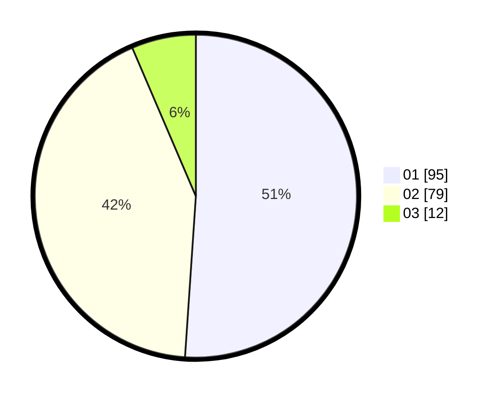

# Hasil

Hasil perolehan suara paslon dapat dilihat pada file paslon-01.txt, paslon-02.txt, dan paslon-03.txt.

Jika tidak ada, artinya data tersebut belum ada pada SIREKAP.

## Perolehan Suara

 * Paslon 01: **95**.
 * Paslon 02: **79**.
 * Paslon 03: **12**.

## Foto C Plano

https://sirekap-obj-formc.kpu.go.id/ecc9/pemilu/ppwp/31/73/02/10/01/3173021001049-20240214-201701--41a695ea-273c-4ce8-b132-16f49e22ac89.jpg

https://sirekap-obj-formc.kpu.go.id/ecc9/pemilu/ppwp/31/73/02/10/01/3173021001049-20240214-193422--34d5edbe-22ec-4eae-a39d-a7dec2835328.jpg

https://sirekap-obj-formc.kpu.go.id/ecc9/pemilu/ppwp/31/73/02/10/01/3173021001049-20240214-195712--25b55b22-61a5-4cc6-ae02-c5a1e7be1a07.jpg

## DATA PEMILIH TETAP

Jumlah pemilih dalam DPT: **261**.
 * L: **138**.
 * P: **123**.

## DATA PENGGUNA HAK PILIH

Jumlah pengguna hak pilih dalam DPT: **191**.
 * L: **94**.
 * P: **97**.

Jumlah pengguna hak pilih dalam DPTb: **4**.
 * L: **0**.
 * P: **4**.

Jumlah pengguna hak pilih dalam DPK: **0**.
 * L: **0**.
 * P: **0**.

Jumlah pengguna hak pilih: **195**.
 * L: **94**.
 * P: **101**.

## JUMLAH SUARA SAH DAN TIDAK SAH

JUMLAH SELURUH SUARA SAH: **186**.

JUMLAH SUARA TIDAK SAH: **9**.

JUMLAH SELURUH SUARA SAH DAN SUARA TIDAK SAH: **195**.
