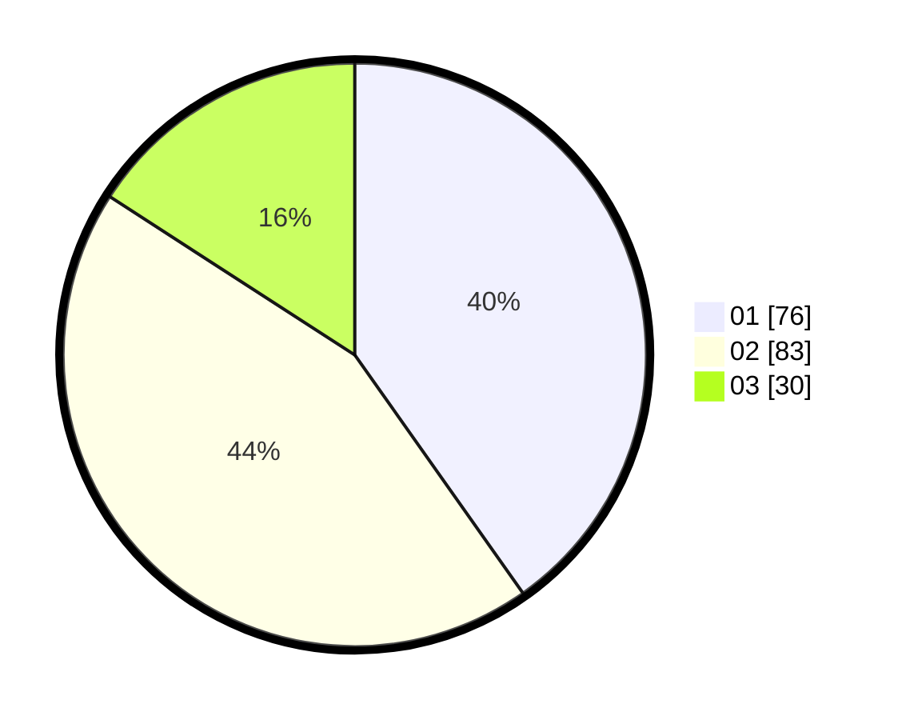

# Hasil

Hasil perolehan suara paslon dapat dilihat pada file paslon-01.txt, paslon-02.txt, dan paslon-03.txt.

Jika tidak ada, artinya data tersebut belum ada pada SIREKAP.

## Perolehan Suara

 * Paslon 01: **76**.
 * Paslon 02: **83**.
 * Paslon 03: **30**.

## Foto C Plano

https://sirekap-obj-formc.kpu.go.id/a34c/pemilu/ppwp/31/73/02/10/01/3173021001050-20240214-191116--20ff9b3e-8c4b-472e-83d7-701be0830956.jpg

https://sirekap-obj-formc.kpu.go.id/a34c/pemilu/ppwp/31/73/02/10/01/3173021001050-20240214-191402--a963d43f-2b5a-4670-addf-16dc7a53d39a.jpg

https://sirekap-obj-formc.kpu.go.id/a34c/pemilu/ppwp/31/73/02/10/01/3173021001050-20240214-192802--e608da17-2c82-4c81-8857-f2470d91672c.jpg

## DATA PEMILIH TETAP

Jumlah pemilih dalam DPT: **255**.
 * L: **126**.
 * P: **129**.

## DATA PENGGUNA HAK PILIH

Jumlah pengguna hak pilih dalam DPT: **187**.
 * L: **89**.
 * P: **98**.

Jumlah pengguna hak pilih dalam DPTb: **3**.
 * L: **1**.
 * P: **2**.

Jumlah pengguna hak pilih dalam DPK: **1**.
 * L: **0**.
 * P: **1**.

Jumlah pengguna hak pilih: **191**.
 * L: **90**.
 * P: **101**.

## JUMLAH SUARA SAH DAN TIDAK SAH

JUMLAH SELURUH SUARA SAH: **189**.

JUMLAH SUARA TIDAK SAH: **2**.

JUMLAH SELURUH SUARA SAH DAN SUARA TIDAK SAH: **191**.
