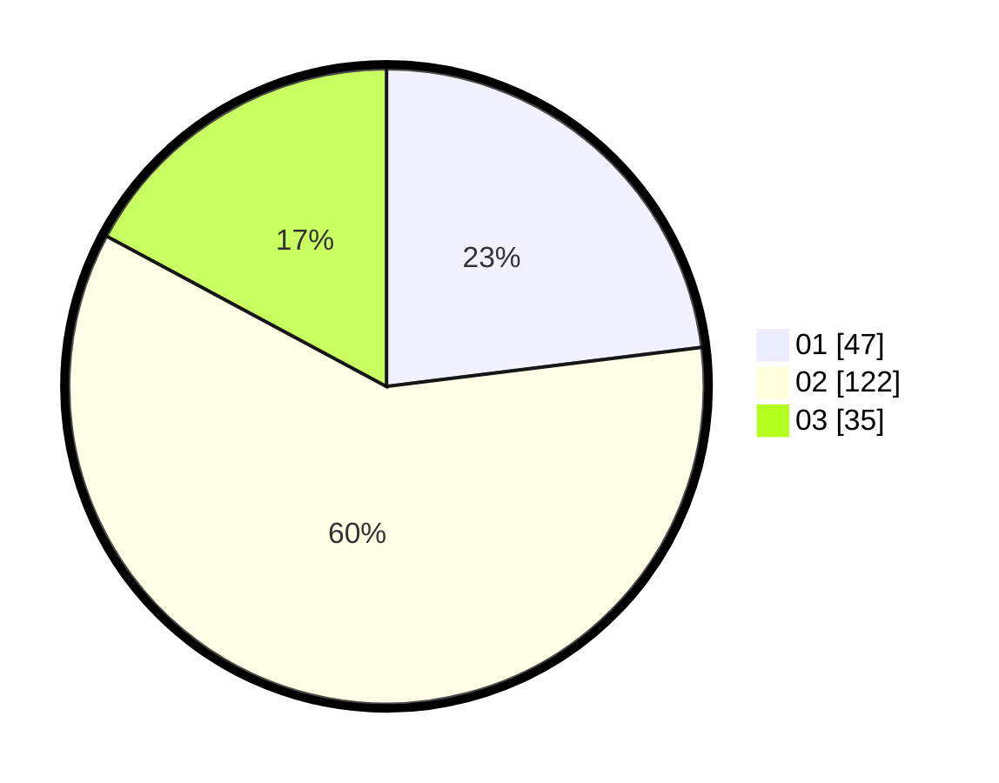

# Hasil

Hasil perolehan suara paslon dapat dilihat pada file paslon-01.txt, paslon-02.txt, dan paslon-03.txt.

Jika tidak ada, artinya data tersebut belum ada pada SIREKAP.

## Perolehan Suara

 * Paslon 01: **47**.
 * Paslon 02: **122**.
 * Paslon 03: **35**.

## Foto C Plano

https://sirekap-obj-formc.kpu.go.id/cfe4/pemilu/ppwp/31/73/02/10/01/3173021001052-20240214-195318--db65bd29-09e6-4db9-ba2e-5065e3fbd4d4.jpg

https://sirekap-obj-formc.kpu.go.id/cfe4/pemilu/ppwp/31/73/02/10/01/3173021001052-20240214-215516--c9841e1f-218a-470a-abec-3cbc38363cb3.jpg

https://sirekap-obj-formc.kpu.go.id/cfe4/pemilu/ppwp/31/73/02/10/01/3173021001052-20240214-195337--978ca86e-1b55-4f5a-8aaf-0c23e8a85464.jpg

## DATA PEMILIH TETAP

Jumlah pemilih dalam DPT: **256**.
 * L: **130**.
 * P: **126**.

## DATA PENGGUNA HAK PILIH

Jumlah pengguna hak pilih dalam DPT: **201**.
 * L: **101**.
 * P: **100**.

Jumlah pengguna hak pilih dalam DPTb: **4**.
 * L: **2**.
 * P: **2**.

Jumlah pengguna hak pilih dalam DPK: **1**.
 * L: **1**.
 * P: **0**.

Jumlah pengguna hak pilih: **206**.
 * L: **104**.
 * P: **102**.

## JUMLAH SUARA SAH DAN TIDAK SAH

JUMLAH SELURUH SUARA SAH: **204**.

JUMLAH SUARA TIDAK SAH: **2**.

JUMLAH SELURUH SUARA SAH DAN SUARA TIDAK SAH: **206**.
