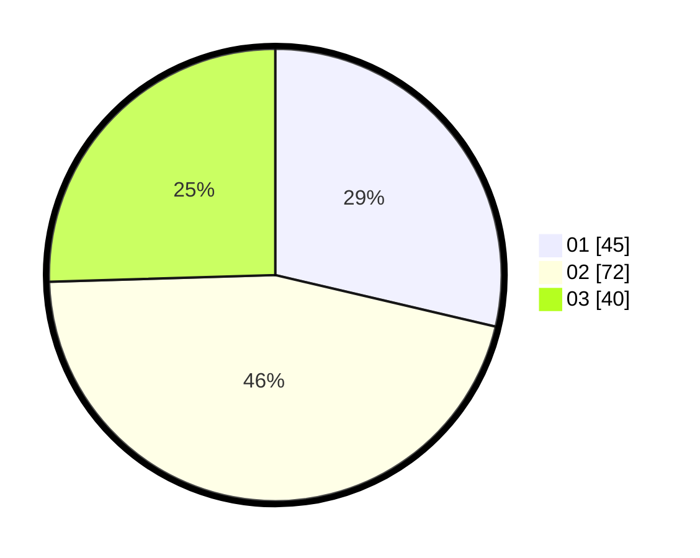

# Hasil

Hasil perolehan suara paslon dapat dilihat pada file paslon-01.txt, paslon-02.txt, dan paslon-03.txt.

Jika tidak ada, artinya data tersebut belum ada pada SIREKAP.

## Perolehan Suara

 * Paslon 01: **45**.
 * Paslon 02: **72**.
 * Paslon 03: **40**.

## Foto C Plano

https://sirekap-obj-formc.kpu.go.id/1110/pemilu/ppwp/31/73/02/10/01/3173021001056-20240217-163500--7c7c227e-33f3-4bf3-9a82-d6e6bed20c11.jpg

https://sirekap-obj-formc.kpu.go.id/1110/pemilu/ppwp/31/73/02/10/01/3173021001056-20240217-163626--c68b1004-8a64-403a-8bf2-7eac68091a85.jpg

https://sirekap-obj-formc.kpu.go.id/1110/pemilu/ppwp/31/73/02/10/01/3173021001056-20240217-164014--b3a6e2ec-3e95-495c-beea-6dbc7a8ed6a2.jpg

## DATA PEMILIH TETAP

Jumlah pemilih dalam DPT: **237**.
 * L: **116**.
 * P: **121**.

## DATA PENGGUNA HAK PILIH

Jumlah pengguna hak pilih dalam DPT: **153**.
 * L: **74**.
 * P: **79**.

Jumlah pengguna hak pilih dalam DPTb: **6**.
 * L: **3**.
 * P: **3**.

Jumlah pengguna hak pilih dalam DPK: **0**.
 * L: **0**.
 * P: **0**.

Jumlah pengguna hak pilih: **159**.
 * L: **77**.
 * P: **82**.

## JUMLAH SUARA SAH DAN TIDAK SAH

JUMLAH SELURUH SUARA SAH: **157**.

JUMLAH SUARA TIDAK SAH: **2**.

JUMLAH SELURUH SUARA SAH DAN SUARA TIDAK SAH: **159**.
