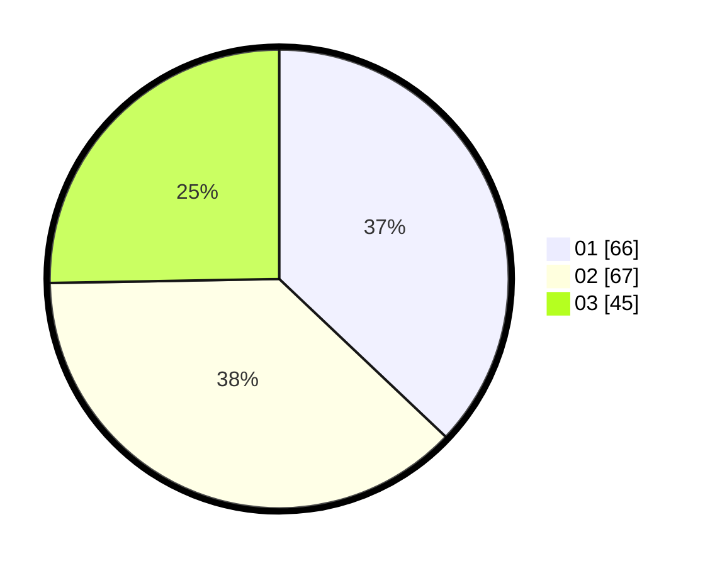

# Hasil

Hasil perolehan suara paslon dapat dilihat pada file paslon-01.txt, paslon-02.txt, dan paslon-03.txt.

Jika tidak ada, artinya data tersebut belum ada pada SIREKAP.

## Perolehan Suara

 * Paslon 01: **66**.
 * Paslon 02: **67**.
 * Paslon 03: **45**.

## Foto C Plano

https://sirekap-obj-formc.kpu.go.id/f72a/pemilu/ppwp/31/73/02/10/01/3173021001058-20240216-192400--66c15673-6ebf-4d31-ba64-4bd753286c0d.jpg

https://sirekap-obj-formc.kpu.go.id/f72a/pemilu/ppwp/31/73/02/10/01/3173021001058-20240214-201120--7161f8d0-2de9-4c9e-ab02-234d334eeac5.jpg

https://sirekap-obj-formc.kpu.go.id/f72a/pemilu/ppwp/31/73/02/10/01/3173021001058-20240214-201155--62b0c97b-997a-4209-82b8-c55cd1c13977.jpg
