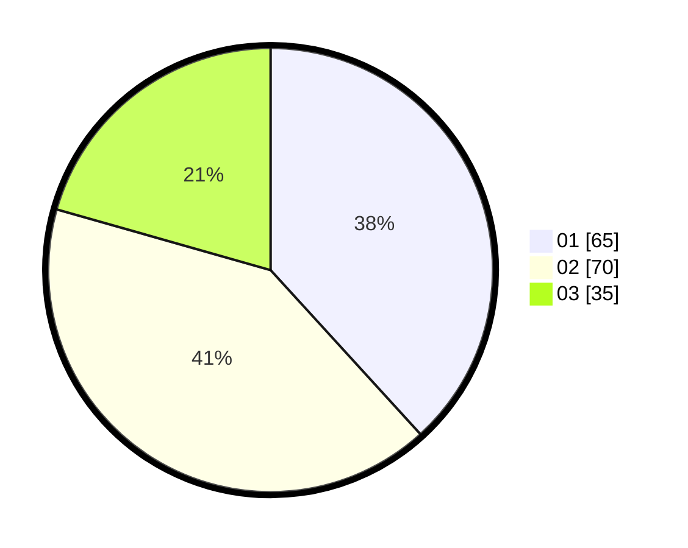

# Hasil

Hasil perolehan suara paslon dapat dilihat pada file paslon-01.txt, paslon-02.txt, dan paslon-03.txt.

Jika tidak ada, artinya data tersebut belum ada pada SIREKAP.

## Perolehan Suara

 * Paslon 01: **65**.
 * Paslon 02: **70**.
 * Paslon 03: **35**.

## Foto C Plano

https://sirekap-obj-formc.kpu.go.id/7b4c/pemilu/ppwp/31/73/02/10/01/3173021001059-20240214-192000--22c62bc2-dc94-4c1c-9f9d-0e12a6e341ed.jpg

https://sirekap-obj-formc.kpu.go.id/7b4c/pemilu/ppwp/31/73/02/10/01/3173021001059-20240214-192125--d83c29e9-f242-4e16-8e9a-bed61478d16a.jpg

https://sirekap-obj-formc.kpu.go.id/7b4c/pemilu/ppwp/31/73/02/10/01/3173021001059-20240214-192247--97e53e7f-6e10-483e-974c-78109de386f7.jpg

## DATA PEMILIH TETAP

Jumlah pemilih dalam DPT: **225**.
 * L: **118**.
 * P: **107**.

## DATA PENGGUNA HAK PILIH

Jumlah pengguna hak pilih dalam DPT: **167**.
 * L: **85**.
 * P: **82**.

Jumlah pengguna hak pilih dalam DPTb: **6**.
 * L: **3**.
 * P: **3**.

Jumlah pengguna hak pilih dalam DPK: **0**.
 * L: **0**.
 * P: **0**.

Jumlah pengguna hak pilih: **173**.
 * L: **88**.
 * P: **85**.

## JUMLAH SUARA SAH DAN TIDAK SAH

JUMLAH SELURUH SUARA SAH: **170**.

JUMLAH SUARA TIDAK SAH: **3**.

JUMLAH SELURUH SUARA SAH DAN SUARA TIDAK SAH: **173**.
