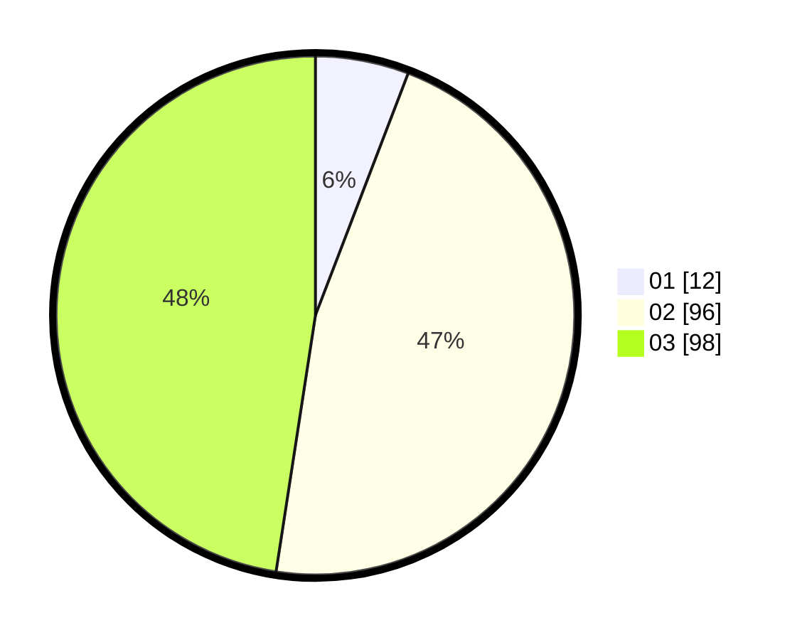

# Hasil

Hasil perolehan suara paslon dapat dilihat pada file paslon-01.txt, paslon-02.txt, dan paslon-03.txt.

Jika tidak ada, artinya data tersebut belum ada pada SIREKAP.

## Perolehan Suara

 * Paslon 01: **12**.
 * Paslon 02: **96**.
 * Paslon 03: **98**.

## Foto C Plano

https://sirekap-obj-formc.kpu.go.id/71f0/pemilu/ppwp/31/73/02/10/02/3173021002001-20240214-211310--37c65fe2-9d5e-4576-8762-388ea5589991.jpg

https://sirekap-obj-formc.kpu.go.id/71f0/pemilu/ppwp/31/73/02/10/02/3173021002001-20240214-211348--6a9cd64c-dfd8-4c0b-a05b-03008195c7bc.jpg

https://sirekap-obj-formc.kpu.go.id/71f0/pemilu/ppwp/31/73/02/10/02/3173021002001-20240214-211415--12959109-2862-4400-bc16-a0f6d79f4b11.jpg

## DATA PEMILIH TETAP

Jumlah pemilih dalam DPT: **264**.
 * L: **129**.
 * P: **135**.

## DATA PENGGUNA HAK PILIH

Jumlah pengguna hak pilih dalam DPT: **176**.
 * L: **86**.
 * P: **90**.

Jumlah pengguna hak pilih dalam DPTb: **25**.
 * L: **16**.
 * P: **9**.

Jumlah pengguna hak pilih dalam DPK: **6**.
 * L: **1**.
 * P: **5**.

Jumlah pengguna hak pilih: **207**.
 * L: **103**.
 * P: **104**.

## JUMLAH SUARA SAH DAN TIDAK SAH

JUMLAH SELURUH SUARA SAH: **206**.

JUMLAH SUARA TIDAK SAH: **1**.

JUMLAH SELURUH SUARA SAH DAN SUARA TIDAK SAH: **207**.
