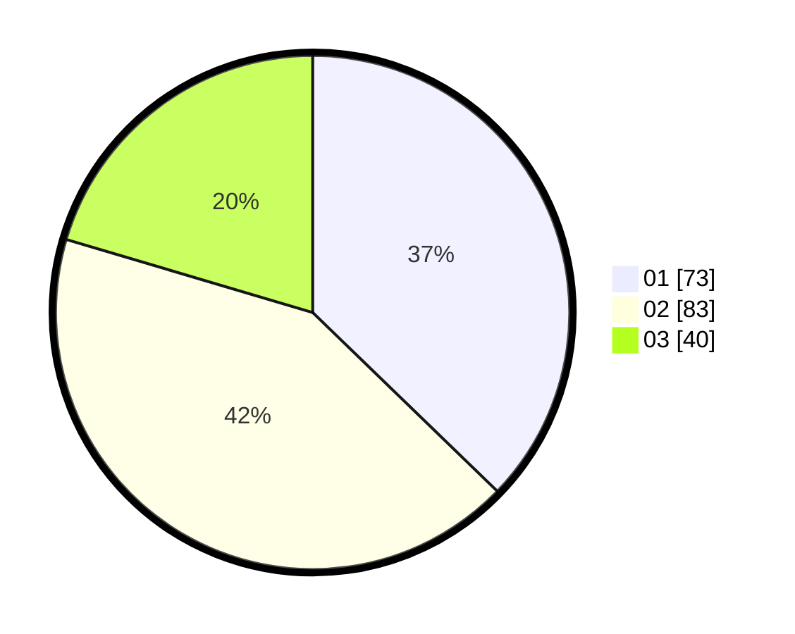

# Hasil

Hasil perolehan suara paslon dapat dilihat pada file paslon-01.txt, paslon-02.txt, dan paslon-03.txt.

Jika tidak ada, artinya data tersebut belum ada pada SIREKAP.

## Perolehan Suara

 * Paslon 01: **73**.
 * Paslon 02: **83**.
 * Paslon 03: **40**.

## Foto C Plano

https://sirekap-obj-formc.kpu.go.id/9b96/pemilu/ppwp/31/73/02/10/02/3173021002009-20240214-192810--dfddf2ad-4914-4e1d-93a9-80ffe38b846e.jpg

https://sirekap-obj-formc.kpu.go.id/9b96/pemilu/ppwp/31/73/02/10/02/3173021002009-20240214-194006--14e32750-3916-47a4-a952-d858f5c570d9.jpg

https://sirekap-obj-formc.kpu.go.id/9b96/pemilu/ppwp/31/73/02/10/02/3173021002009-20240214-213128--e870880b-7646-43eb-b6e6-f36c9abb4650.jpg
