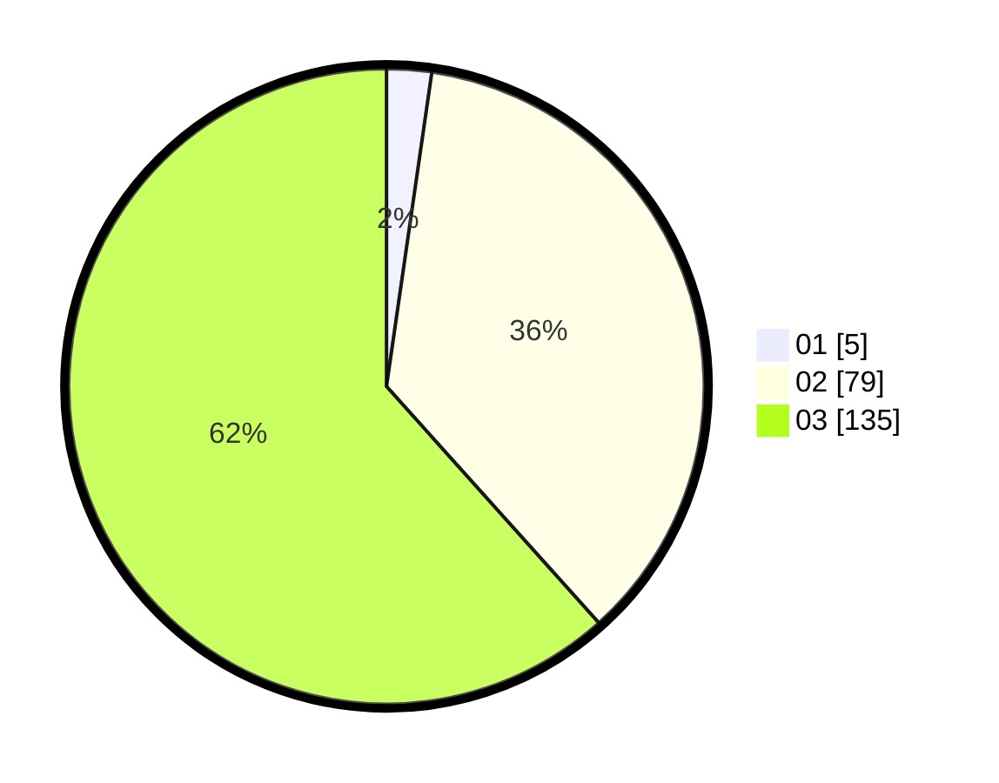

# Hasil

Hasil perolehan suara paslon dapat dilihat pada file paslon-01.txt, paslon-02.txt, dan paslon-03.txt.

Jika tidak ada, artinya data tersebut belum ada pada SIREKAP.

## Perolehan Suara

 * Paslon 01: **5**.
 * Paslon 02: **79**.
 * Paslon 03: **135**.

## Foto C Plano

https://sirekap-obj-formc.kpu.go.id/075a/pemilu/ppwp/31/73/02/10/02/3173021002014-20240214-223258--0246d2a7-9699-4121-8cf2-2f4b9273b3a8.jpg

https://sirekap-obj-formc.kpu.go.id/075a/pemilu/ppwp/31/73/02/10/02/3173021002014-20240214-223327--7b930ab2-a17b-44c0-b1e9-20268cc9c9a7.jpg

https://sirekap-obj-formc.kpu.go.id/075a/pemilu/ppwp/31/73/02/10/02/3173021002014-20240214-223333--2eebe7b1-965d-4535-92ac-feee0cb1d5d9.jpg

## DATA PEMILIH TETAP

Jumlah pemilih dalam DPT: **282**.
 * L: **124**.
 * P: **158**.

## DATA PENGGUNA HAK PILIH

Jumlah pengguna hak pilih dalam DPT: **203**.
 * L: **91**.
 * P: **112**.

Jumlah pengguna hak pilih dalam DPTb: **19**.
 * L: **7**.
 * P: **12**.

Jumlah pengguna hak pilih dalam DPK: **1**.
 * L: **0**.
 * P: **1**.

Jumlah pengguna hak pilih: **223**.
 * L: **98**.
 * P: **125**.

## JUMLAH SUARA SAH DAN TIDAK SAH

JUMLAH SELURUH SUARA SAH: **219**.

JUMLAH SUARA TIDAK SAH: **4**.

JUMLAH SELURUH SUARA SAH DAN SUARA TIDAK SAH: **223**.
