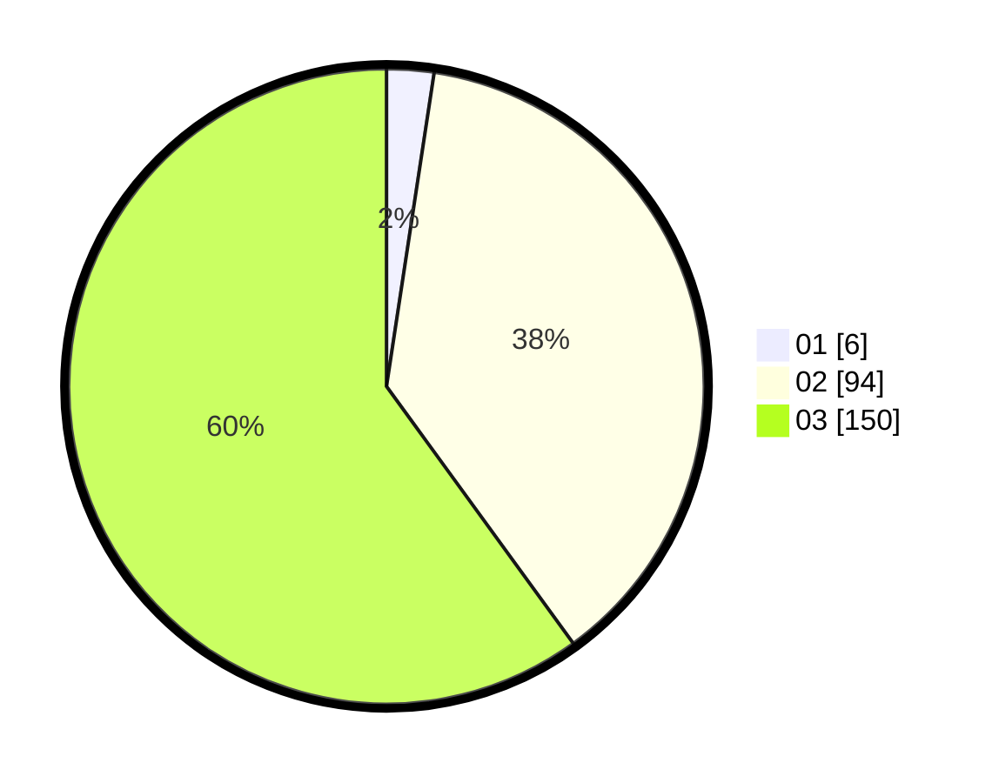

# Hasil

Hasil perolehan suara paslon dapat dilihat pada file paslon-01.txt, paslon-02.txt, dan paslon-03.txt.

Jika tidak ada, artinya data tersebut belum ada pada SIREKAP.

## Perolehan Suara

 * Paslon 01: **6**.
 * Paslon 02: **94**.
 * Paslon 03: **150**.

## Foto C Plano

https://sirekap-obj-formc.kpu.go.id/a65c/pemilu/ppwp/31/73/02/10/02/3173021002023-20240214-220612--0f4d4e82-fa60-4ae4-a74f-e9de5bdb2911.jpg

https://sirekap-obj-formc.kpu.go.id/a65c/pemilu/ppwp/31/73/02/10/02/3173021002023-20240214-220731--6a9a6694-e95b-48da-b964-8be49711b113.jpg

https://sirekap-obj-formc.kpu.go.id/a65c/pemilu/ppwp/31/73/02/10/02/3173021002023-20240214-220830--3ffe6af1-a9cc-4bf0-bd2c-f181d45e1327.jpg
