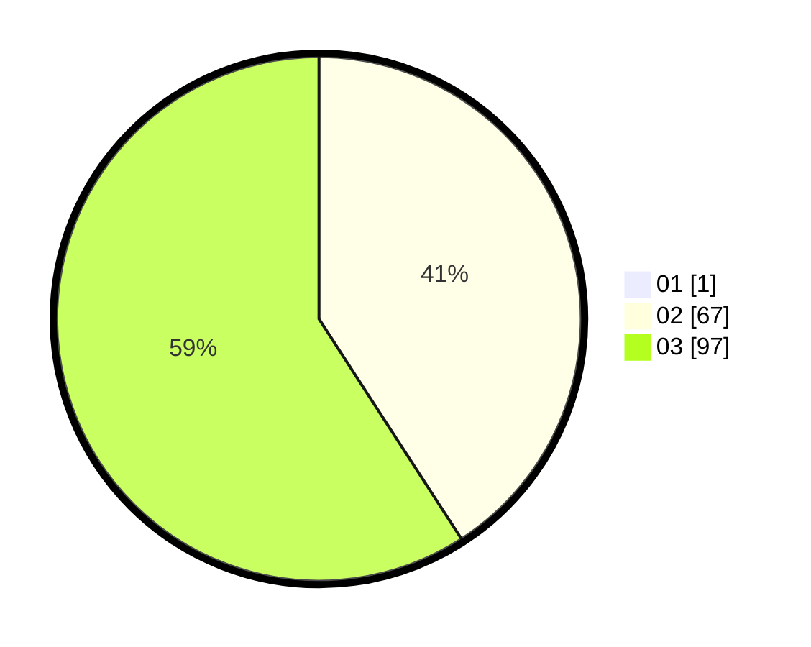

# Hasil

Hasil perolehan suara paslon dapat dilihat pada file paslon-01.txt, paslon-02.txt, dan paslon-03.txt.

Jika tidak ada, artinya data tersebut belum ada pada SIREKAP.

## Perolehan Suara

 * Paslon 01: **1**.
 * Paslon 02: **67**.
 * Paslon 03: **97**.

## Foto C Plano

https://sirekap-obj-formc.kpu.go.id/5e69/pemilu/ppwp/31/73/02/10/02/3173021002025-20240214-185107--9ac84aaf-e933-423b-9851-feb349a853db.jpg

https://sirekap-obj-formc.kpu.go.id/5e69/pemilu/ppwp/31/73/02/10/02/3173021002025-20240214-184941--00e0cd1b-e39e-4076-9318-1558b393e4a4.jpg

https://sirekap-obj-formc.kpu.go.id/5e69/pemilu/ppwp/31/73/02/10/02/3173021002025-20240214-185047--c3c2ea5e-1c6d-45d1-a18e-84815449973a.jpg

## DATA PEMILIH TETAP

Jumlah pemilih dalam DPT: **202**.
 * L: **90**.
 * P: **112**.

## DATA PENGGUNA HAK PILIH

Jumlah pengguna hak pilih dalam DPT: **163**.
 * L: **74**.
 * P: **89**.

Jumlah pengguna hak pilih dalam DPTb: **3**.
 * L: **1**.
 * P: **2**.

Jumlah pengguna hak pilih dalam DPK: **2**.
 * L: **1**.
 * P: **1**.

Jumlah pengguna hak pilih: **168**.
 * L: **76**.
 * P: **92**.

## JUMLAH SUARA SAH DAN TIDAK SAH

JUMLAH SELURUH SUARA SAH: **165**.

JUMLAH SUARA TIDAK SAH: **3**.

JUMLAH SELURUH SUARA SAH DAN SUARA TIDAK SAH: **168**.
