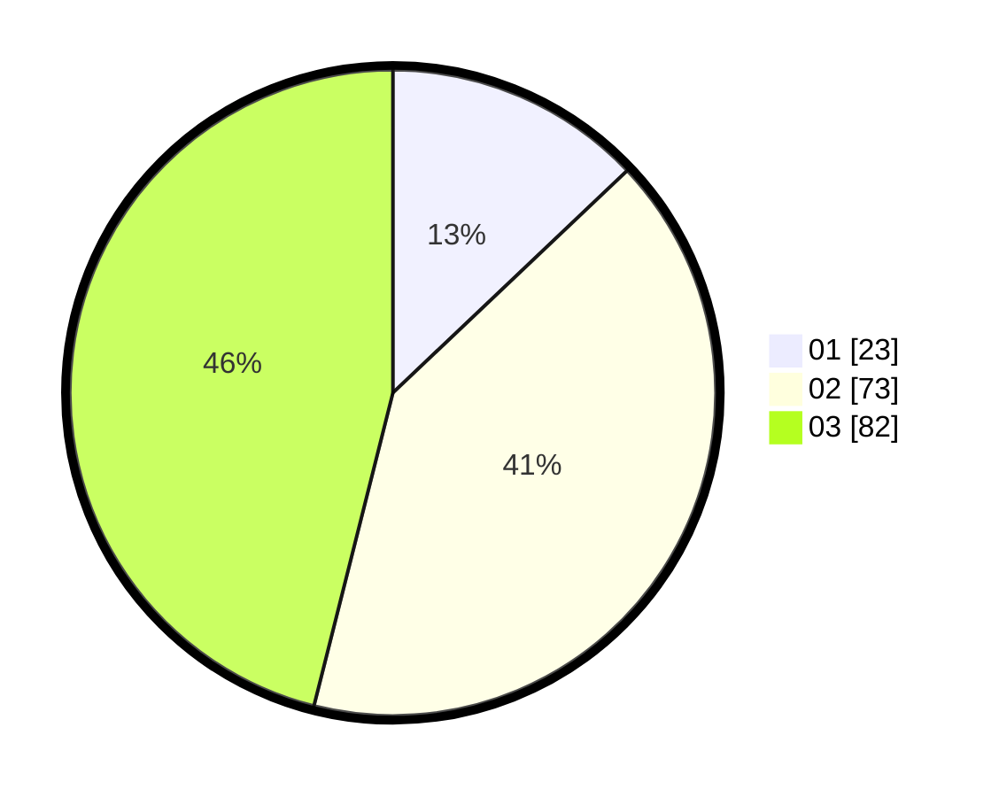

# Hasil

Hasil perolehan suara paslon dapat dilihat pada file paslon-01.txt, paslon-02.txt, dan paslon-03.txt.

Jika tidak ada, artinya data tersebut belum ada pada SIREKAP.

## Perolehan Suara

 * Paslon 01: **23**.
 * Paslon 02: **73**.
 * Paslon 03: **82**.

## Foto C Plano

https://sirekap-obj-formc.kpu.go.id/1fc5/pemilu/ppwp/31/73/02/10/02/3173021002026-20240216-033519--6f320ae3-743f-4dd1-bc2c-6b73fca9be2a.jpg

https://sirekap-obj-formc.kpu.go.id/1fc5/pemilu/ppwp/31/73/02/10/02/3173021002026-20240216-033521--bc8ac328-a922-4617-8891-3b7f03b6c4d2.jpg

https://sirekap-obj-formc.kpu.go.id/1fc5/pemilu/ppwp/31/73/02/10/02/3173021002026-20240216-033520--a8fcb2f8-f23c-4597-8c24-d59b92b1f1b1.jpg

## DATA PEMILIH TETAP

Jumlah pemilih dalam DPT: **0**.
 * L: **0**.
 * P: **0**.

## DATA PENGGUNA HAK PILIH

Jumlah pengguna hak pilih dalam DPT: **0**.
 * L: **0**.
 * P: **0**.

Jumlah pengguna hak pilih dalam DPTb: **0**.
 * L: **0**.
 * P: **0**.

Jumlah pengguna hak pilih dalam DPK: **0**.
 * L: **0**.
 * P: **0**.

Jumlah pengguna hak pilih: **0**.
 * L: **0**.
 * P: **0**.

## JUMLAH SUARA SAH DAN TIDAK SAH

JUMLAH SELURUH SUARA SAH: **178**.

JUMLAH SUARA TIDAK SAH: **3**.

JUMLAH SELURUH SUARA SAH DAN SUARA TIDAK SAH: **181**.
