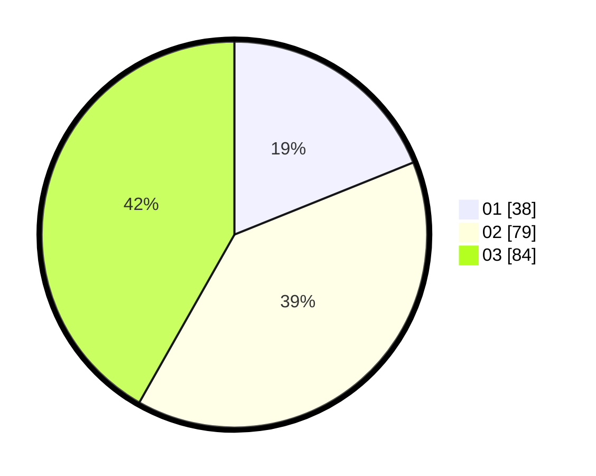

# Hasil

Hasil perolehan suara paslon dapat dilihat pada file paslon-01.txt, paslon-02.txt, dan paslon-03.txt.

Jika tidak ada, artinya data tersebut belum ada pada SIREKAP.

## Perolehan Suara

 * Paslon 01: **38**.
 * Paslon 02: **79**.
 * Paslon 03: **84**.

## Foto C Plano

https://sirekap-obj-formc.kpu.go.id/f32e/pemilu/ppwp/31/73/02/10/02/3173021002027-20240214-155928--f58cbd21-6614-4d59-ab0e-1abf476b0658.jpg

https://sirekap-obj-formc.kpu.go.id/f32e/pemilu/ppwp/31/73/02/10/02/3173021002027-20240214-160100--c3d97e72-c481-4682-bb77-b4008df8603b.jpg

https://sirekap-obj-formc.kpu.go.id/f32e/pemilu/ppwp/31/73/02/10/02/3173021002027-20240214-162237--c341b1c3-5c4d-41c3-af0c-cee3d90ffab0.jpg

## DATA PEMILIH TETAP

Jumlah pemilih dalam DPT: **267**.
 * L: **127**.
 * P: **140**.

## DATA PENGGUNA HAK PILIH

Jumlah pengguna hak pilih dalam DPT: **204**.
 * L: **95**.
 * P: **109**.

Jumlah pengguna hak pilih dalam DPTb: **1**.
 * L: **1**.
 * P: **0**.

Jumlah pengguna hak pilih dalam DPK: **0**.
 * L: **0**.
 * P: **0**.

Jumlah pengguna hak pilih: **205**.
 * L: **96**.
 * P: **109**.

## JUMLAH SUARA SAH DAN TIDAK SAH

JUMLAH SELURUH SUARA SAH: **201**.

JUMLAH SUARA TIDAK SAH: **4**.

JUMLAH SELURUH SUARA SAH DAN SUARA TIDAK SAH: **205**.
