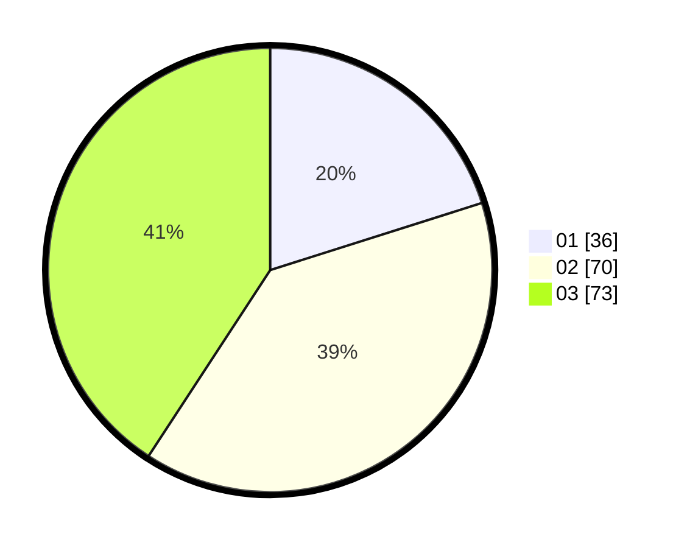

# Hasil

Hasil perolehan suara paslon dapat dilihat pada file paslon-01.txt, paslon-02.txt, dan paslon-03.txt.

Jika tidak ada, artinya data tersebut belum ada pada SIREKAP.

## Perolehan Suara

 * Paslon 01: **36**.
 * Paslon 02: **70**.
 * Paslon 03: **73**.

## Foto C Plano

https://sirekap-obj-formc.kpu.go.id/1017/pemilu/ppwp/31/73/02/10/02/3173021002028-20240215-001531--3bcab484-c8c4-4d67-a1ad-2598c2c2d4dd.jpg

https://sirekap-obj-formc.kpu.go.id/1017/pemilu/ppwp/31/73/02/10/02/3173021002028-20240215-001605--436cf177-854f-4ea8-9c2e-8d7264896da0.jpg

https://sirekap-obj-formc.kpu.go.id/1017/pemilu/ppwp/31/73/02/10/02/3173021002028-20240215-001617--30a0ac80-5b3b-4426-a27a-5e28bfa639fc.jpg
