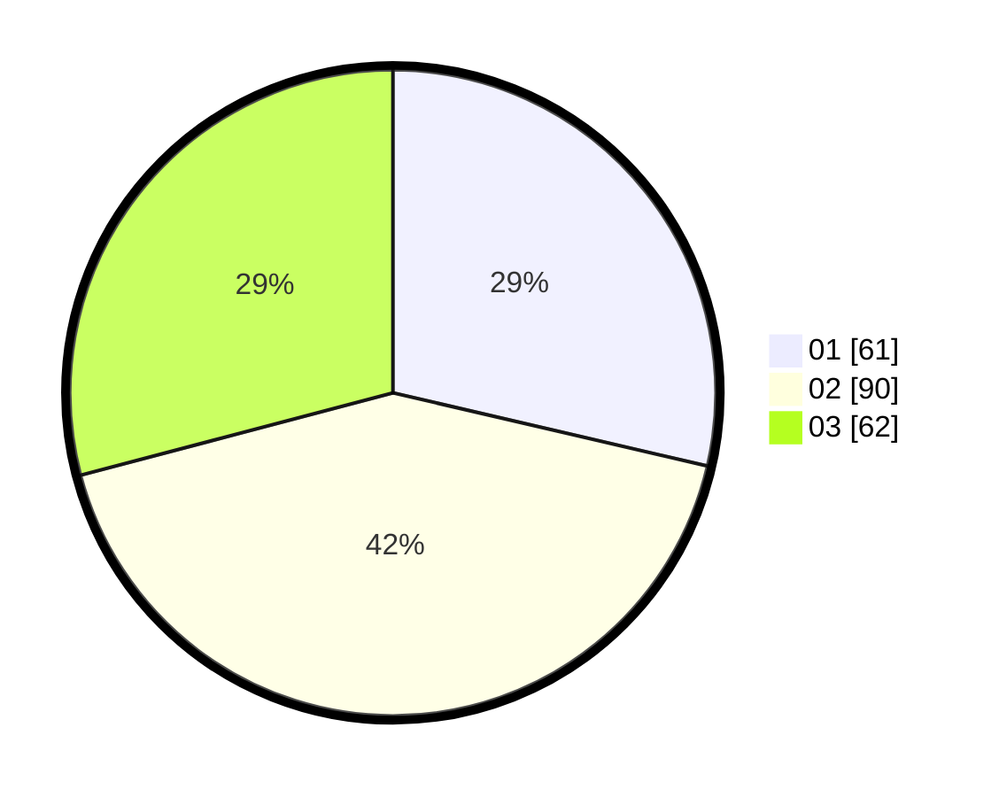

# Hasil

Hasil perolehan suara paslon dapat dilihat pada file paslon-01.txt, paslon-02.txt, dan paslon-03.txt.

Jika tidak ada, artinya data tersebut belum ada pada SIREKAP.

## Perolehan Suara

 * Paslon 01: **61**.
 * Paslon 02: **90**.
 * Paslon 03: **62**.

## Foto C Plano

https://sirekap-obj-formc.kpu.go.id/809e/pemilu/ppwp/31/73/02/10/02/3173021002030-20240216-010027--7533d7e6-ca0a-4fcc-a7a7-53abacbe76da.jpg

https://sirekap-obj-formc.kpu.go.id/809e/pemilu/ppwp/31/73/02/10/02/3173021002030-20240216-010032--ba6c0db0-023c-4e94-aec0-e7e577bb53da.jpg

https://sirekap-obj-formc.kpu.go.id/809e/pemilu/ppwp/31/73/02/10/02/3173021002030-20240216-010030--5aa60b7c-00e7-4372-949f-6bb601433da3.jpg

## DATA PEMILIH TETAP

Jumlah pemilih dalam DPT: **269**.
 * L: **139**.
 * P: **130**.

## DATA PENGGUNA HAK PILIH

Jumlah pengguna hak pilih dalam DPT: **205**.
 * L: **101**.
 * P: **104**.

Jumlah pengguna hak pilih dalam DPTb: **3**.
 * L: **0**.
 * P: **3**.

Jumlah pengguna hak pilih dalam DPK: **6**.
 * L: **3**.
 * P: **3**.

Jumlah pengguna hak pilih: **214**.
 * L: **104**.
 * P: **110**.

## JUMLAH SUARA SAH DAN TIDAK SAH

JUMLAH SELURUH SUARA SAH: **213**.

JUMLAH SUARA TIDAK SAH: **1**.

JUMLAH SELURUH SUARA SAH DAN SUARA TIDAK SAH: **214**.
