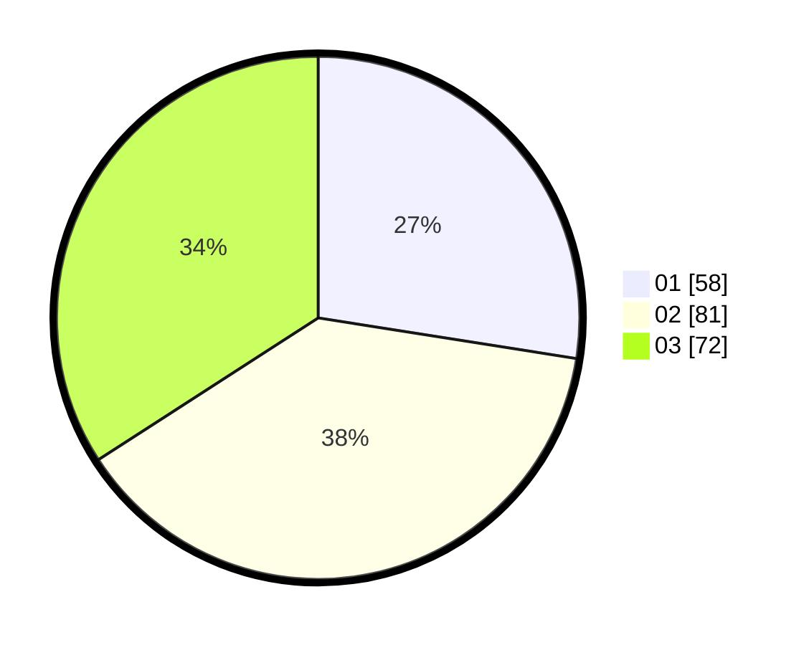

# Hasil

Hasil perolehan suara paslon dapat dilihat pada file paslon-01.txt, paslon-02.txt, dan paslon-03.txt.

Jika tidak ada, artinya data tersebut belum ada pada SIREKAP.

## Perolehan Suara

 * Paslon 01: **58**.
 * Paslon 02: **81**.
 * Paslon 03: **72**.

## Foto C Plano

https://sirekap-obj-formc.kpu.go.id/57f8/pemilu/ppwp/31/73/02/10/02/3173021002031-20240214-223020--ff4ddb17-e33b-418c-bcfc-be9313ba049c.jpg

https://sirekap-obj-formc.kpu.go.id/57f8/pemilu/ppwp/31/73/02/10/02/3173021002031-20240214-223151--6e41c816-65a8-49d2-9565-70203bd62dc5.jpg

https://sirekap-obj-formc.kpu.go.id/57f8/pemilu/ppwp/31/73/02/10/02/3173021002031-20240214-223243--8db38a1a-6849-4c30-b43a-df0ccae5f304.jpg
