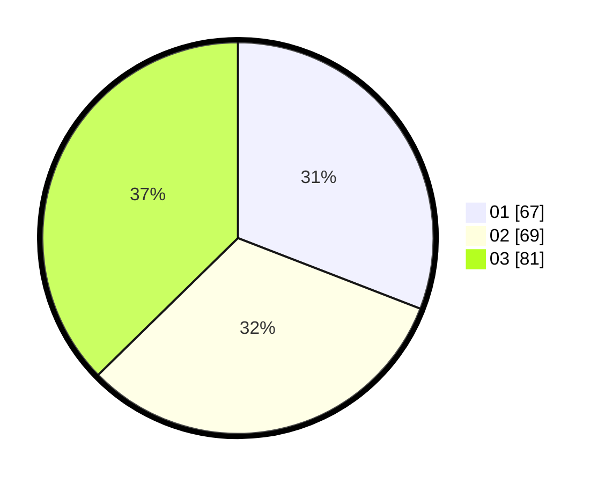

# Hasil

Hasil perolehan suara paslon dapat dilihat pada file paslon-01.txt, paslon-02.txt, dan paslon-03.txt.

Jika tidak ada, artinya data tersebut belum ada pada SIREKAP.

## Perolehan Suara

 * Paslon 01: **67**.
 * Paslon 02: **69**.
 * Paslon 03: **81**.

## Foto C Plano

https://sirekap-obj-formc.kpu.go.id/b033/pemilu/ppwp/31/73/02/10/02/3173021002036-20240215-022448--9e9089c8-11b3-4ba0-9d61-40cb4d2626bd.jpg

https://sirekap-obj-formc.kpu.go.id/b033/pemilu/ppwp/31/73/02/10/02/3173021002036-20240215-022711--551cf4af-3121-4964-a30e-773b625fc0c5.jpg

https://sirekap-obj-formc.kpu.go.id/b033/pemilu/ppwp/31/73/02/10/02/3173021002036-20240215-022817--23edf8a8-0499-4084-8ee7-e4592538f5e4.jpg
