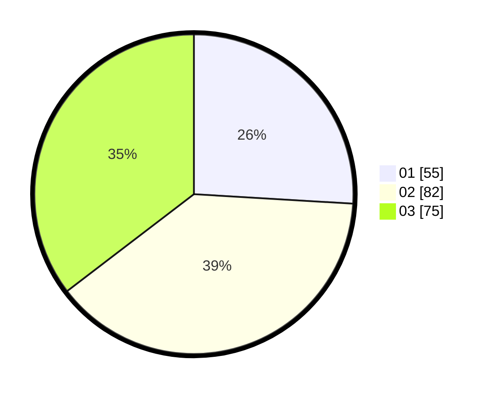

# Hasil

Hasil perolehan suara paslon dapat dilihat pada file paslon-01.txt, paslon-02.txt, dan paslon-03.txt.

Jika tidak ada, artinya data tersebut belum ada pada SIREKAP.

## Perolehan Suara

 * Paslon 01: **55**.
 * Paslon 02: **82**.
 * Paslon 03: **75**.

## Foto C Plano

https://sirekap-obj-formc.kpu.go.id/4438/pemilu/ppwp/31/73/02/10/02/3173021002037-20240214-155148--af5f6e1a-bac4-44a3-ba45-303c392038a3.jpg

https://sirekap-obj-formc.kpu.go.id/4438/pemilu/ppwp/31/73/02/10/02/3173021002037-20240214-155715--5ff39ed2-dbb5-424b-b2c4-cae0db3afa22.jpg

https://sirekap-obj-formc.kpu.go.id/4438/pemilu/ppwp/31/73/02/10/02/3173021002037-20240214-213957--4a42cafe-e927-4599-8600-2b984b03ed75.jpg

## DATA PEMILIH TETAP

Jumlah pemilih dalam DPT: **278**.
 * L: **143**.
 * P: **135**.

## DATA PENGGUNA HAK PILIH

Jumlah pengguna hak pilih dalam DPT: **210**.
 * L: **101**.
 * P: **109**.

Jumlah pengguna hak pilih dalam DPTb: **7**.
 * L: **2**.
 * P: **5**.

Jumlah pengguna hak pilih dalam DPK: **0**.
 * L: **0**.
 * P: **0**.

Jumlah pengguna hak pilih: **217**.
 * L: **103**.
 * P: **114**.

## JUMLAH SUARA SAH DAN TIDAK SAH

JUMLAH SELURUH SUARA SAH: **212**.

JUMLAH SUARA TIDAK SAH: **5**.

JUMLAH SELURUH SUARA SAH DAN SUARA TIDAK SAH: **217**.
