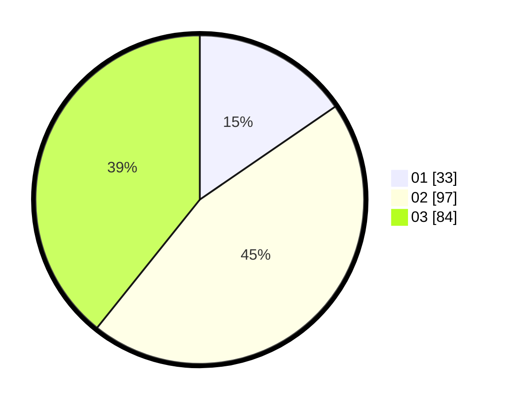

# Hasil

Hasil perolehan suara paslon dapat dilihat pada file paslon-01.txt, paslon-02.txt, dan paslon-03.txt.

Jika tidak ada, artinya data tersebut belum ada pada SIREKAP.

## Perolehan Suara

 * Paslon 01: **33**.
 * Paslon 02: **97**.
 * Paslon 03: **84**.

## Foto C Plano

https://sirekap-obj-formc.kpu.go.id/0587/pemilu/ppwp/31/73/02/10/02/3173021002041-20240214-200119--612c6e04-a778-44c9-b208-9e21196a1438.jpg

https://sirekap-obj-formc.kpu.go.id/0587/pemilu/ppwp/31/73/02/10/02/3173021002041-20240214-200406--eaf0a25b-99d2-4276-b58e-0b82b9121f2a.jpg

https://sirekap-obj-formc.kpu.go.id/0587/pemilu/ppwp/31/73/02/10/02/3173021002041-20240214-202552--64bc069f-40fb-4032-8734-13f58cf0443b.jpg

## DATA PEMILIH TETAP

Jumlah pemilih dalam DPT: **269**.
 * L: **129**.
 * P: **140**.

## DATA PENGGUNA HAK PILIH

Jumlah pengguna hak pilih dalam DPT: **210**.
 * L: **98**.
 * P: **112**.

Jumlah pengguna hak pilih dalam DPTb: **6**.
 * L: **1**.
 * P: **5**.

Jumlah pengguna hak pilih dalam DPK: **1**.
 * L: **1**.
 * P: **0**.

Jumlah pengguna hak pilih: **217**.
 * L: **100**.
 * P: **117**.

## JUMLAH SUARA SAH DAN TIDAK SAH

JUMLAH SELURUH SUARA SAH: **214**.

JUMLAH SUARA TIDAK SAH: **3**.

JUMLAH SELURUH SUARA SAH DAN SUARA TIDAK SAH: **217**.
