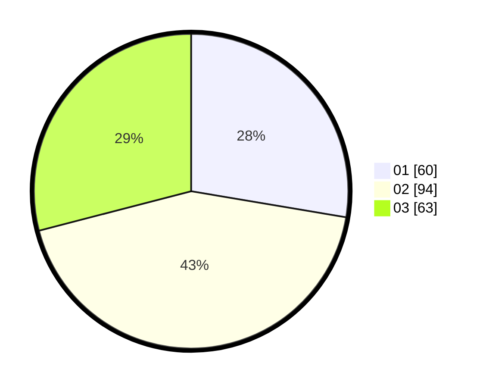

# Hasil

Hasil perolehan suara paslon dapat dilihat pada file paslon-01.txt, paslon-02.txt, dan paslon-03.txt.

Jika tidak ada, artinya data tersebut belum ada pada SIREKAP.

## Perolehan Suara

 * Paslon 01: **60**.
 * Paslon 02: **94**.
 * Paslon 03: **63**.

## Foto C Plano

https://sirekap-obj-formc.kpu.go.id/e0cc/pemilu/ppwp/31/73/02/10/02/3173021002045-20240215-011721--71d39167-d92e-4b9b-a5a8-c514b9c8c5d6.jpg

https://sirekap-obj-formc.kpu.go.id/e0cc/pemilu/ppwp/31/73/02/10/02/3173021002045-20240215-012042--6cf27886-a8f3-4e77-801a-f4e8af21583e.jpg

https://sirekap-obj-formc.kpu.go.id/e0cc/pemilu/ppwp/31/73/02/10/02/3173021002045-20240215-012217--3290d52a-9619-40a8-874c-4ebc0bf28e0c.jpg
