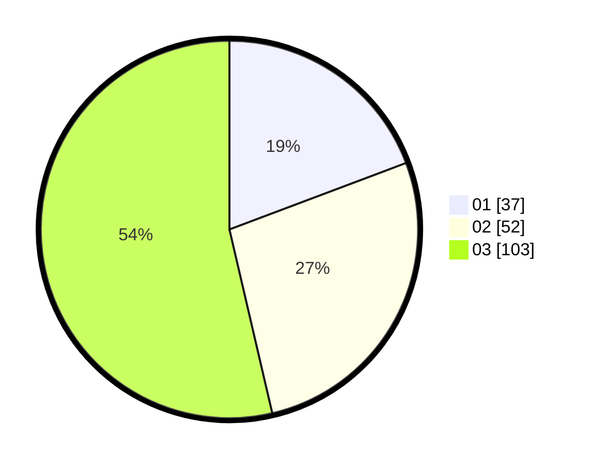

# Hasil

Hasil perolehan suara paslon dapat dilihat pada file paslon-01.txt, paslon-02.txt, dan paslon-03.txt.

Jika tidak ada, artinya data tersebut belum ada pada SIREKAP.

## Perolehan Suara

 * Paslon 01: **37**.
 * Paslon 02: **52**.
 * Paslon 03: **103**.

## Foto C Plano

https://sirekap-obj-formc.kpu.go.id/244f/pemilu/ppwp/31/73/02/10/02/3173021002047-20240215-181531--7c66a74e-f1af-41e9-8276-243c3e961257.jpg

https://sirekap-obj-formc.kpu.go.id/244f/pemilu/ppwp/31/73/02/10/02/3173021002047-20240215-004045--5aa9c518-7437-475e-b241-98d12144a059.jpg

https://sirekap-obj-formc.kpu.go.id/244f/pemilu/ppwp/31/73/02/10/02/3173021002047-20240214-192953--392e19cb-7b27-4005-ad20-ba7a8878ddd1.jpg
