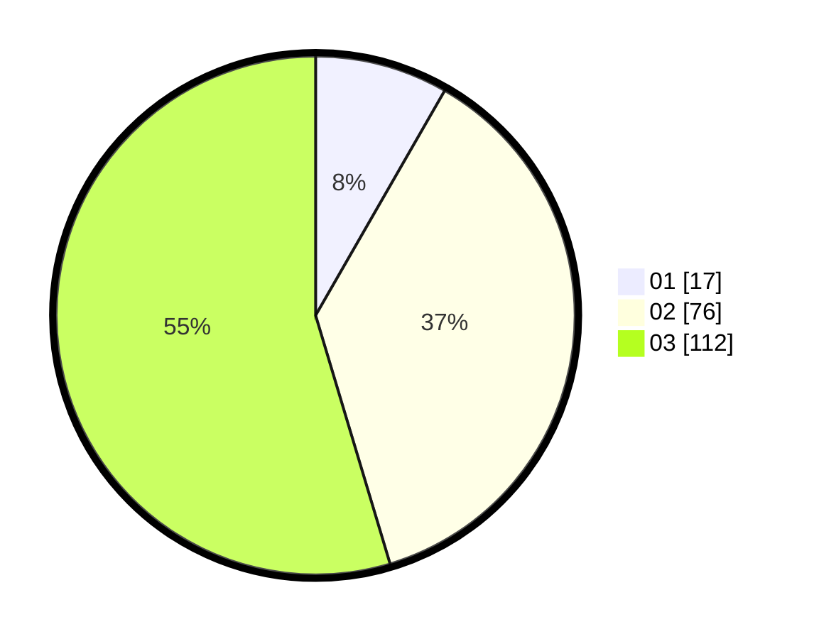

# Hasil

Hasil perolehan suara paslon dapat dilihat pada file paslon-01.txt, paslon-02.txt, dan paslon-03.txt.

Jika tidak ada, artinya data tersebut belum ada pada SIREKAP.

## Perolehan Suara

 * Paslon 01: **17**.
 * Paslon 02: **76**.
 * Paslon 03: **112**.

## Foto C Plano

https://sirekap-obj-formc.kpu.go.id/40f6/pemilu/ppwp/31/73/02/10/02/3173021002050-20240216-040554--b9266e68-688d-4076-af1d-633ca9e91455.jpg

https://sirekap-obj-formc.kpu.go.id/40f6/pemilu/ppwp/31/73/02/10/02/3173021002050-20240216-041429--e01aae4a-a868-4690-ac43-7e057c23d425.jpg

https://sirekap-obj-formc.kpu.go.id/40f6/pemilu/ppwp/31/73/02/10/02/3173021002050-20240216-040601--2804b103-8f44-4869-9509-4220eeab967c.jpg

## DATA PEMILIH TETAP

Jumlah pemilih dalam DPT: **275**.
 * L: **125**.
 * P: **150**.

## DATA PENGGUNA HAK PILIH

Jumlah pengguna hak pilih dalam DPT: **200**.
 * L: **89**.
 * P: **111**.

Jumlah pengguna hak pilih dalam DPTb: **2**.
 * L: **1**.
 * P: **1**.

Jumlah pengguna hak pilih dalam DPK: **4**.
 * L: **2**.
 * P: **2**.

Jumlah pengguna hak pilih: **206**.
 * L: **92**.
 * P: **114**.

## JUMLAH SUARA SAH DAN TIDAK SAH

JUMLAH SELURUH SUARA SAH: **205**.

JUMLAH SUARA TIDAK SAH: **1**.

JUMLAH SELURUH SUARA SAH DAN SUARA TIDAK SAH: **206**.
