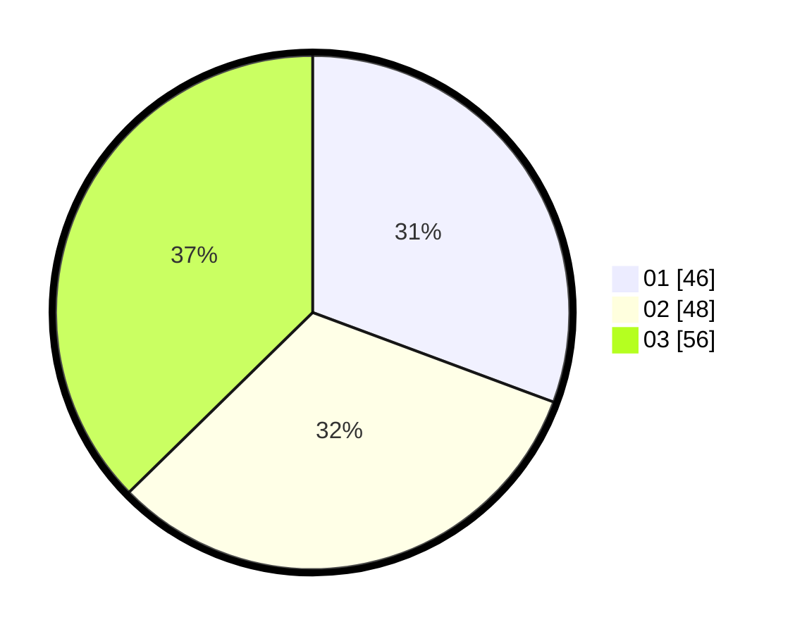

# Hasil

Hasil perolehan suara paslon dapat dilihat pada file paslon-01.txt, paslon-02.txt, dan paslon-03.txt.

Jika tidak ada, artinya data tersebut belum ada pada SIREKAP.

## Perolehan Suara

 * Paslon 01: **46**.
 * Paslon 02: **48**.
 * Paslon 03: **56**.

## Foto C Plano

https://sirekap-obj-formc.kpu.go.id/5bfc/pemilu/ppwp/31/73/02/10/02/3173021002051-20240214-224144--e4724b24-81cf-4163-a547-337fd5752cbc.jpg

https://sirekap-obj-formc.kpu.go.id/5bfc/pemilu/ppwp/31/73/02/10/02/3173021002051-20240214-224239--80d2e139-f2f3-4f4d-b424-855b85031d18.jpg

https://sirekap-obj-formc.kpu.go.id/5bfc/pemilu/ppwp/31/73/02/10/02/3173021002051-20240214-224328--f486dc9c-5d0d-4755-afb1-ecf33f4bf1a3.jpg

## DATA PEMILIH TETAP

Jumlah pemilih dalam DPT: **200**.
 * L: **87**.
 * P: **113**.

## DATA PENGGUNA HAK PILIH

Jumlah pengguna hak pilih dalam DPT: **142**.
 * L: **78**.
 * P: **64**.

Jumlah pengguna hak pilih dalam DPTb: **10**.
 * L: **9**.
 * P: **1**.

Jumlah pengguna hak pilih dalam DPK: **1**.
 * L: **0**.
 * P: **1**.

Jumlah pengguna hak pilih: **153**.
 * L: **87**.
 * P: **66**.

## JUMLAH SUARA SAH DAN TIDAK SAH

JUMLAH SELURUH SUARA SAH: **150**.

JUMLAH SUARA TIDAK SAH: **3**.

JUMLAH SELURUH SUARA SAH DAN SUARA TIDAK SAH: **153**.
