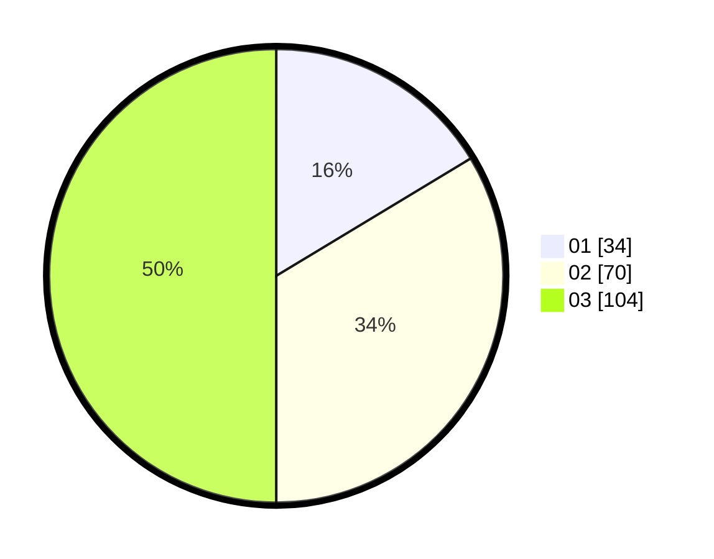

# Hasil

Hasil perolehan suara paslon dapat dilihat pada file paslon-01.txt, paslon-02.txt, dan paslon-03.txt.

Jika tidak ada, artinya data tersebut belum ada pada SIREKAP.

## Perolehan Suara

 * Paslon 01: **34**.
 * Paslon 02: **70**.
 * Paslon 03: **104**.

## Foto C Plano

https://sirekap-obj-formc.kpu.go.id/d805/pemilu/ppwp/31/73/02/10/02/3173021002055-20240216-024310--dd1c159b-0c65-44dc-826a-b95a4ed6ec83.jpg

https://sirekap-obj-formc.kpu.go.id/d805/pemilu/ppwp/31/73/02/10/02/3173021002055-20240216-024311--3245ccac-87d2-4706-8d39-2e9d952f4611.jpg

https://sirekap-obj-formc.kpu.go.id/d805/pemilu/ppwp/31/73/02/10/02/3173021002055-20240216-024310--f57a15e7-c382-4721-bdfd-120c7c1c0fa7.jpg

## DATA PEMILIH TETAP

Jumlah pemilih dalam DPT: **249**.
 * L: **104**.
 * P: **145**.

## DATA PENGGUNA HAK PILIH

Jumlah pengguna hak pilih dalam DPT: **196**.
 * L: **84**.
 * P: **112**.

Jumlah pengguna hak pilih dalam DPTb: **9**.
 * L: **1**.
 * P: **8**.

Jumlah pengguna hak pilih dalam DPK: **5**.
 * L: **0**.
 * P: **5**.

Jumlah pengguna hak pilih: **210**.
 * L: **85**.
 * P: **125**.

## JUMLAH SUARA SAH DAN TIDAK SAH

JUMLAH SELURUH SUARA SAH: **208**.

JUMLAH SUARA TIDAK SAH: **2**.

JUMLAH SELURUH SUARA SAH DAN SUARA TIDAK SAH: **210**.
