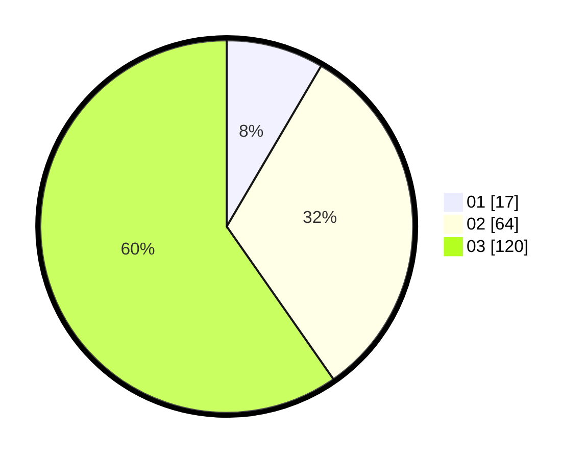

# Hasil

Hasil perolehan suara paslon dapat dilihat pada file paslon-01.txt, paslon-02.txt, dan paslon-03.txt.

Jika tidak ada, artinya data tersebut belum ada pada SIREKAP.

## Perolehan Suara

 * Paslon 01: **17**.
 * Paslon 02: **64**.
 * Paslon 03: **120**.

## Foto C Plano

https://sirekap-obj-formc.kpu.go.id/2ba1/pemilu/ppwp/31/73/02/10/02/3173021002056-20240214-205035--54358104-f771-480d-a186-dfa6fe11f129.jpg

https://sirekap-obj-formc.kpu.go.id/2ba1/pemilu/ppwp/31/73/02/10/02/3173021002056-20240214-205155--d84bfe2e-8772-44db-bfa3-232a1bff9b86.jpg

https://sirekap-obj-formc.kpu.go.id/2ba1/pemilu/ppwp/31/73/02/10/02/3173021002056-20240214-205322--d77d5c5f-3399-48fe-ae0b-98aebfdbe822.jpg
