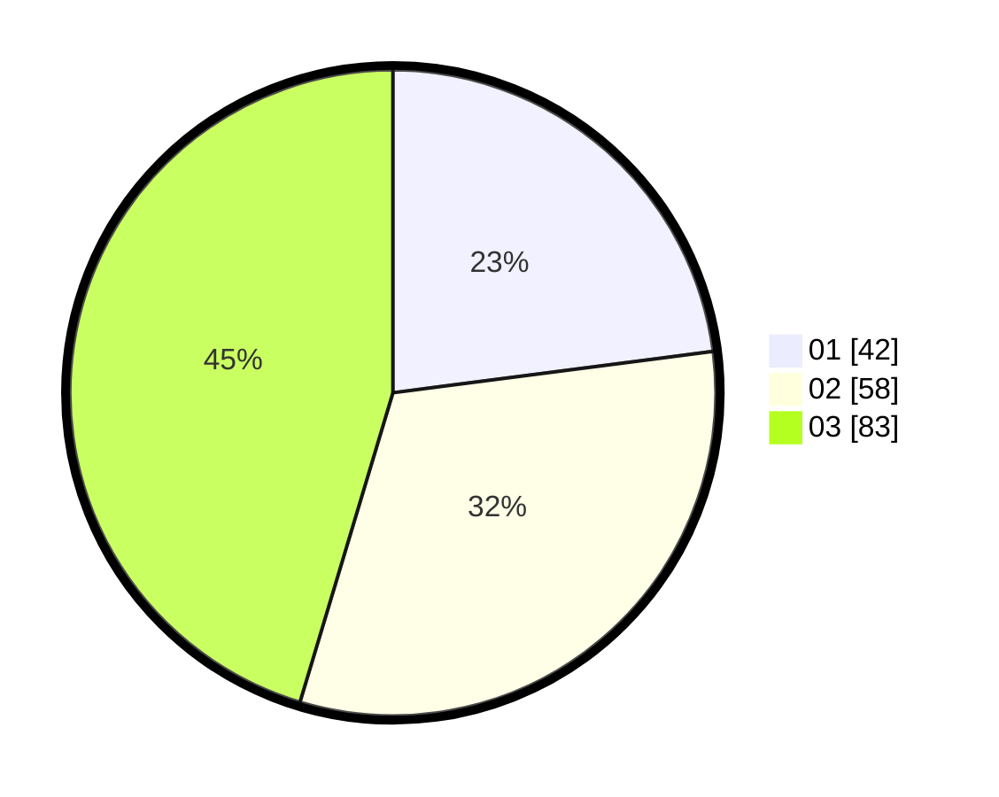

# Hasil

Hasil perolehan suara paslon dapat dilihat pada file paslon-01.txt, paslon-02.txt, dan paslon-03.txt.

Jika tidak ada, artinya data tersebut belum ada pada SIREKAP.

## Perolehan Suara

 * Paslon 01: **42**.
 * Paslon 02: **58**.
 * Paslon 03: **83**.

## Foto C Plano

https://sirekap-obj-formc.kpu.go.id/a14f/pemilu/ppwp/31/73/02/10/03/3173021003001-20240216-040006--30528519-1de0-424e-a5d8-cccbb61faeee.jpg

https://sirekap-obj-formc.kpu.go.id/a14f/pemilu/ppwp/31/73/02/10/03/3173021003001-20240216-040016--34406184-e6a0-41f8-9957-16005ab8f4d3.jpg

https://sirekap-obj-formc.kpu.go.id/a14f/pemilu/ppwp/31/73/02/10/03/3173021003001-20240216-040010--e437f499-5534-4af9-8bd5-7d664c4f6367.jpg

## DATA PEMILIH TETAP

Jumlah pemilih dalam DPT: **215**.
 * L: **107**.
 * P: **108**.

## DATA PENGGUNA HAK PILIH

Jumlah pengguna hak pilih dalam DPT: **166**.
 * L: **79**.
 * P: **87**.

Jumlah pengguna hak pilih dalam DPTb: **11**.
 * L: **8**.
 * P: **3**.

Jumlah pengguna hak pilih dalam DPK: **6**.
 * L: **3**.
 * P: **3**.

Jumlah pengguna hak pilih: **183**.
 * L: **90**.
 * P: **93**.

## JUMLAH SUARA SAH DAN TIDAK SAH

JUMLAH SELURUH SUARA SAH: **183**.

JUMLAH SUARA TIDAK SAH: **0**.

JUMLAH SELURUH SUARA SAH DAN SUARA TIDAK SAH: **183**.
