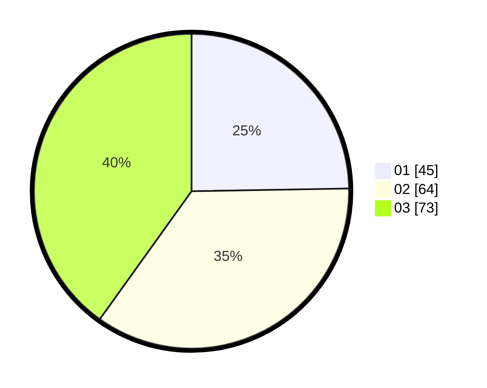

# Hasil

Hasil perolehan suara paslon dapat dilihat pada file paslon-01.txt, paslon-02.txt, dan paslon-03.txt.

Jika tidak ada, artinya data tersebut belum ada pada SIREKAP.

## Perolehan Suara

 * Paslon 01: **45**.
 * Paslon 02: **64**.
 * Paslon 03: **73**.

## Foto C Plano

https://sirekap-obj-formc.kpu.go.id/f2a3/pemilu/ppwp/31/73/02/10/03/3173021003002-20240216-060853--eb4ea29d-b1a2-4efd-9394-2bebc20d70fc.jpg

https://sirekap-obj-formc.kpu.go.id/f2a3/pemilu/ppwp/31/73/02/10/03/3173021003002-20240216-060855--5ca23d6b-498b-494d-afd0-8f0b1c158cc0.jpg

https://sirekap-obj-formc.kpu.go.id/f2a3/pemilu/ppwp/31/73/02/10/03/3173021003002-20240216-060854--811767bb-f98f-4a94-a3f4-7dbcd7950e53.jpg

## DATA PEMILIH TETAP

Jumlah pemilih dalam DPT: **224**.
 * L: **106**.
 * P: **118**.

## DATA PENGGUNA HAK PILIH

Jumlah pengguna hak pilih dalam DPT: **177**.
 * L: **83**.
 * P: **94**.

Jumlah pengguna hak pilih dalam DPTb: **9**.
 * L: **3**.
 * P: **6**.

Jumlah pengguna hak pilih dalam DPK: **2**.
 * L: **1**.
 * P: **1**.

Jumlah pengguna hak pilih: **188**.
 * L: **87**.
 * P: **101**.

## JUMLAH SUARA SAH DAN TIDAK SAH

JUMLAH SELURUH SUARA SAH: **182**.

JUMLAH SUARA TIDAK SAH: **6**.

JUMLAH SELURUH SUARA SAH DAN SUARA TIDAK SAH: **188**.
