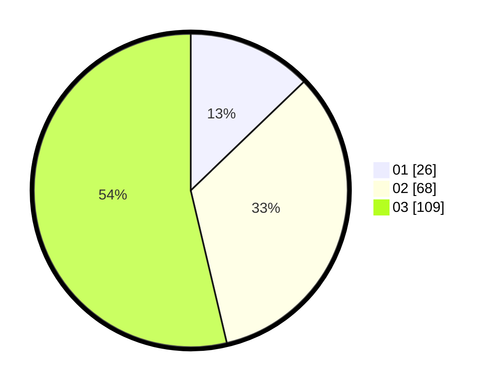

# Hasil

Hasil perolehan suara paslon dapat dilihat pada file paslon-01.txt, paslon-02.txt, dan paslon-03.txt.

Jika tidak ada, artinya data tersebut belum ada pada SIREKAP.

## Perolehan Suara

 * Paslon 01: **26**.
 * Paslon 02: **68**.
 * Paslon 03: **109**.

## Foto C Plano

https://sirekap-obj-formc.kpu.go.id/82c1/pemilu/ppwp/31/73/02/10/03/3173021003012-20240214-162231--4d479739-5c00-45b9-9712-dbaf891892c4.jpg

https://sirekap-obj-formc.kpu.go.id/82c1/pemilu/ppwp/31/73/02/10/03/3173021003012-20240214-225445--ed0c0509-0b71-41c9-8f91-df36aff1e1f2.jpg
