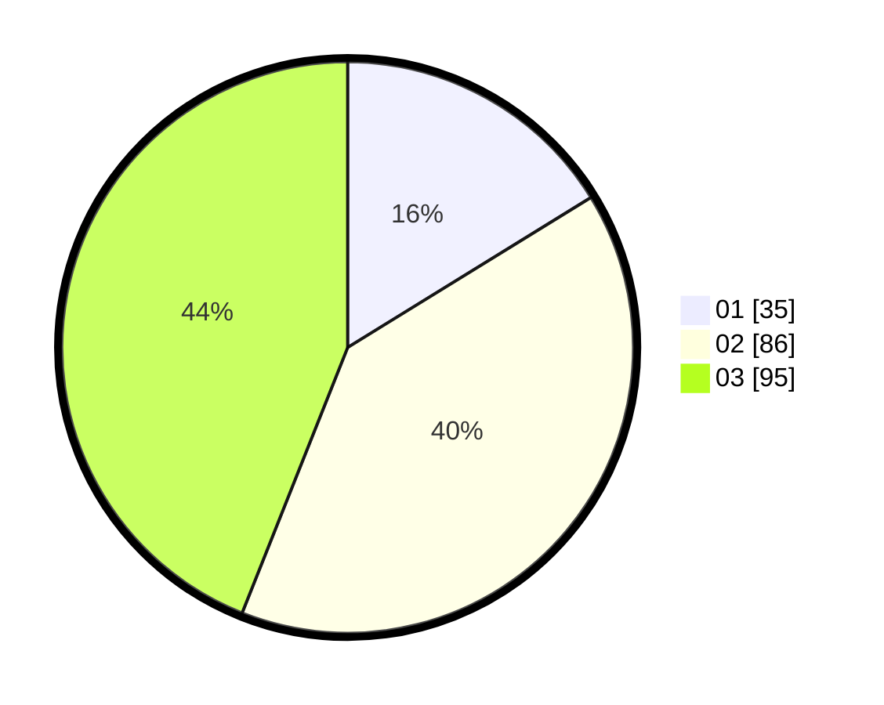

# Hasil

Hasil perolehan suara paslon dapat dilihat pada file paslon-01.txt, paslon-02.txt, dan paslon-03.txt.

Jika tidak ada, artinya data tersebut belum ada pada SIREKAP.

## Perolehan Suara

 * Paslon 01: **35**.
 * Paslon 02: **86**.
 * Paslon 03: **95**.

## Foto C Plano

https://sirekap-obj-formc.kpu.go.id/6347/pemilu/ppwp/31/73/02/10/03/3173021003017-20240215-231641--f229465a-3a83-4710-ac5d-3516cae9798a.jpg

https://sirekap-obj-formc.kpu.go.id/6347/pemilu/ppwp/31/73/02/10/03/3173021003017-20240215-231643--6970e96b-a9da-458f-8162-f2df1ecf7937.jpg

https://sirekap-obj-formc.kpu.go.id/6347/pemilu/ppwp/31/73/02/10/03/3173021003017-20240215-231642--b81f8c20-cddb-4cf1-b1b1-0c0da581e4f5.jpg

## DATA PEMILIH TETAP

Jumlah pemilih dalam DPT: **0**.
 * L: **0**.
 * P: **0**.

## DATA PENGGUNA HAK PILIH

Jumlah pengguna hak pilih dalam DPT: **0**.
 * L: **0**.
 * P: **0**.

Jumlah pengguna hak pilih dalam DPTb: **0**.
 * L: **0**.
 * P: **0**.

Jumlah pengguna hak pilih dalam DPK: **0**.
 * L: **0**.
 * P: **0**.

Jumlah pengguna hak pilih: **0**.
 * L: **0**.
 * P: **0**.

## JUMLAH SUARA SAH DAN TIDAK SAH

JUMLAH SELURUH SUARA SAH: **216**.

JUMLAH SUARA TIDAK SAH: **1**.

JUMLAH SELURUH SUARA SAH DAN SUARA TIDAK SAH: **217**.
