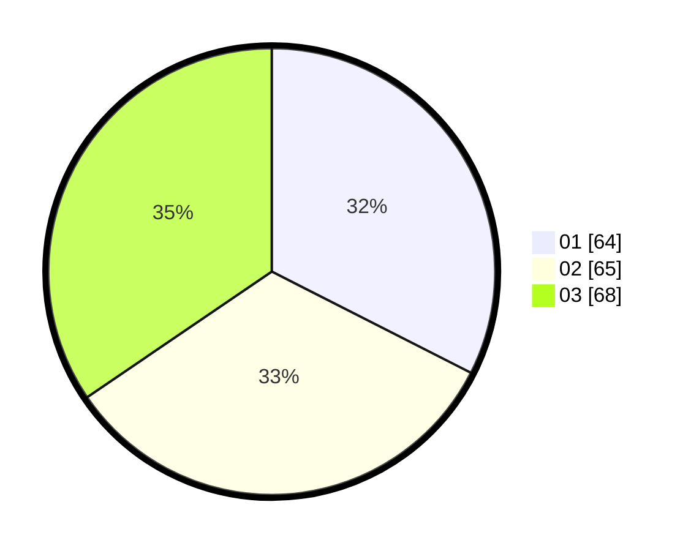

# Hasil

Hasil perolehan suara paslon dapat dilihat pada file paslon-01.txt, paslon-02.txt, dan paslon-03.txt.

Jika tidak ada, artinya data tersebut belum ada pada SIREKAP.

## Perolehan Suara

 * Paslon 01: **64**.
 * Paslon 02: **65**.
 * Paslon 03: **68**.

## Foto C Plano

https://sirekap-obj-formc.kpu.go.id/c8db/pemilu/ppwp/31/73/02/10/03/3173021003021-20240216-021249--c87baf81-b4a7-405f-bf74-7a539e04d452.jpg

https://sirekap-obj-formc.kpu.go.id/c8db/pemilu/ppwp/31/73/02/10/03/3173021003021-20240216-021253--0515e1bf-296e-4825-b165-1aa87d680cc3.jpg

https://sirekap-obj-formc.kpu.go.id/c8db/pemilu/ppwp/31/73/02/10/03/3173021003021-20240216-021250--f7f2dbf2-5129-44dc-9695-2394372a30f9.jpg

## DATA PEMILIH TETAP

Jumlah pemilih dalam DPT: **287**.
 * L: **132**.
 * P: **155**.

## DATA PENGGUNA HAK PILIH

Jumlah pengguna hak pilih dalam DPT: **196**.
 * L: **86**.
 * P: **110**.

Jumlah pengguna hak pilih dalam DPTb: **6**.
 * L: **1**.
 * P: **5**.

Jumlah pengguna hak pilih dalam DPK: **1**.
 * L: **0**.
 * P: **1**.

Jumlah pengguna hak pilih: **203**.
 * L: **87**.
 * P: **116**.

## JUMLAH SUARA SAH DAN TIDAK SAH

JUMLAH SELURUH SUARA SAH: **197**.

JUMLAH SUARA TIDAK SAH: **6**.

JUMLAH SELURUH SUARA SAH DAN SUARA TIDAK SAH: **203**.
