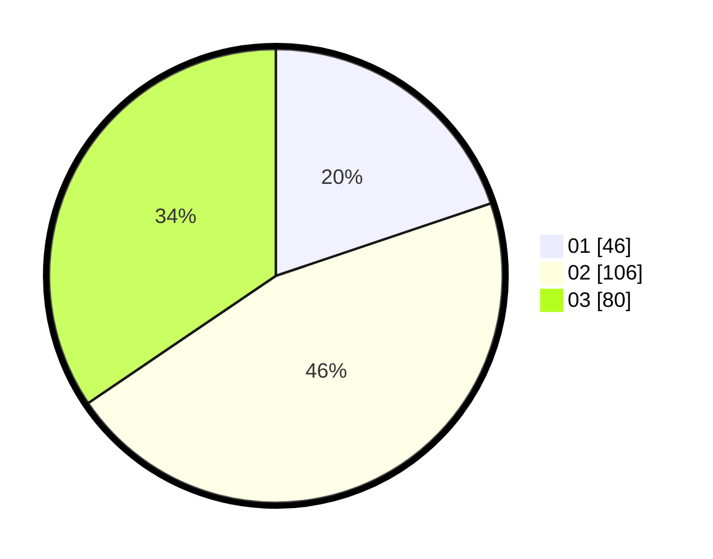

# Hasil

Hasil perolehan suara paslon dapat dilihat pada file paslon-01.txt, paslon-02.txt, dan paslon-03.txt.

Jika tidak ada, artinya data tersebut belum ada pada SIREKAP.

## Perolehan Suara

 * Paslon 01: **46**.
 * Paslon 02: **106**.
 * Paslon 03: **80**.

## Foto C Plano

https://sirekap-obj-formc.kpu.go.id/b107/pemilu/ppwp/31/73/02/10/03/3173021003024-20240216-010029--dadd8bca-b148-4d48-94ad-658c6aa5dff3.jpg

https://sirekap-obj-formc.kpu.go.id/b107/pemilu/ppwp/31/73/02/10/03/3173021003024-20240216-010039--2280bab5-0877-48cd-98d8-8fbdb633e5f8.jpg

https://sirekap-obj-formc.kpu.go.id/b107/pemilu/ppwp/31/73/02/10/03/3173021003024-20240216-010038--e4cc636d-c920-4d62-b153-b23117087cce.jpg

## DATA PEMILIH TETAP

Jumlah pemilih dalam DPT: **292**.
 * L: **137**.
 * P: **155**.

## DATA PENGGUNA HAK PILIH

Jumlah pengguna hak pilih dalam DPT: **221**.
 * L: **102**.
 * P: **119**.

Jumlah pengguna hak pilih dalam DPTb: **7**.
 * L: **2**.
 * P: **5**.

Jumlah pengguna hak pilih dalam DPK: **4**.
 * L: **0**.
 * P: **4**.

Jumlah pengguna hak pilih: **232**.
 * L: **104**.
 * P: **128**.

## JUMLAH SUARA SAH DAN TIDAK SAH

JUMLAH SELURUH SUARA SAH: **232**.

JUMLAH SUARA TIDAK SAH: **0**.

JUMLAH SELURUH SUARA SAH DAN SUARA TIDAK SAH: **232**.
