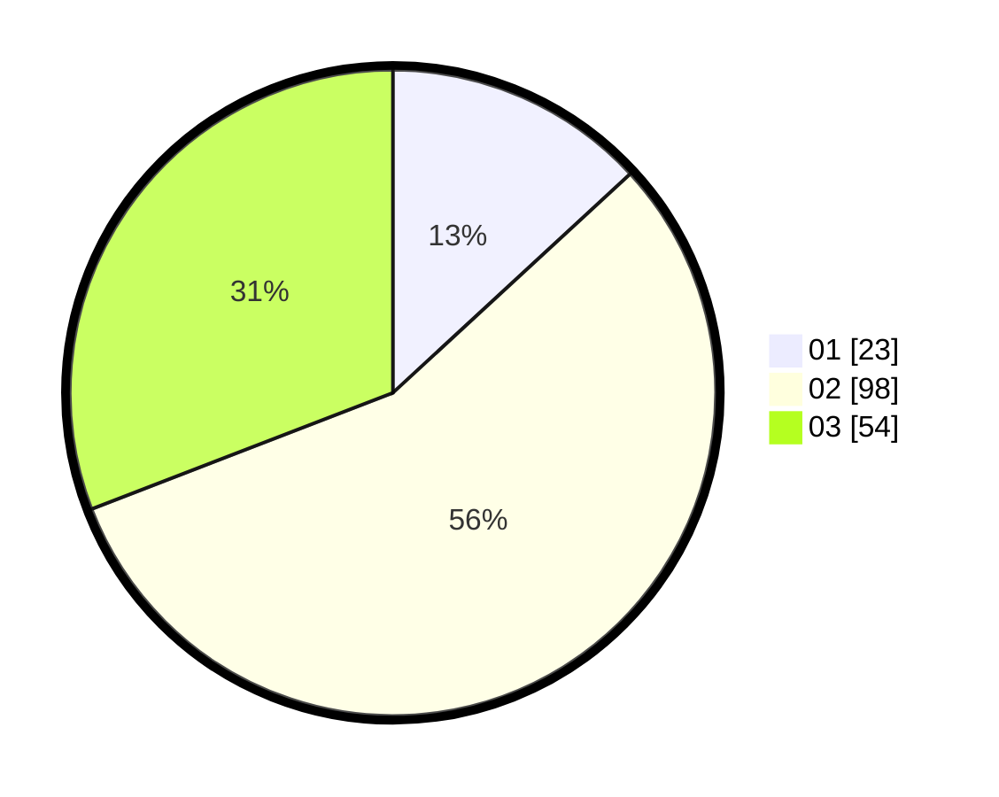

# Hasil

Hasil perolehan suara paslon dapat dilihat pada file paslon-01.txt, paslon-02.txt, dan paslon-03.txt.

Jika tidak ada, artinya data tersebut belum ada pada SIREKAP.

## Perolehan Suara

 * Paslon 01: **23**.
 * Paslon 02: **98**.
 * Paslon 03: **54**.

## Foto C Plano

https://sirekap-obj-formc.kpu.go.id/2a0d/pemilu/ppwp/31/73/02/10/03/3173021003025-20240214-155524--717ca950-cce5-4acb-b59d-204bc8704488.jpg

https://sirekap-obj-formc.kpu.go.id/2a0d/pemilu/ppwp/31/73/02/10/03/3173021003025-20240214-155725--f6f8d938-544c-404d-a34b-0bb290a80d84.jpg

https://sirekap-obj-formc.kpu.go.id/2a0d/pemilu/ppwp/31/73/02/10/03/3173021003025-20240214-155853--7a00e55e-8dcc-4efd-9244-52ce9a683ec0.jpg

## DATA PEMILIH TETAP

Jumlah pemilih dalam DPT: **237**.
 * L: **122**.
 * P: **115**.

## DATA PENGGUNA HAK PILIH

Jumlah pengguna hak pilih dalam DPT: **182**.
 * L: **91**.
 * P: **91**.

Jumlah pengguna hak pilih dalam DPTb: **0**.
 * L: **0**.
 * P: **0**.

Jumlah pengguna hak pilih dalam DPK: **0**.
 * L: **0**.
 * P: **0**.

Jumlah pengguna hak pilih: **182**.
 * L: **91**.
 * P: **91**.

## JUMLAH SUARA SAH DAN TIDAK SAH

JUMLAH SELURUH SUARA SAH: **175**.

JUMLAH SUARA TIDAK SAH: **7**.

JUMLAH SELURUH SUARA SAH DAN SUARA TIDAK SAH: **182**.
