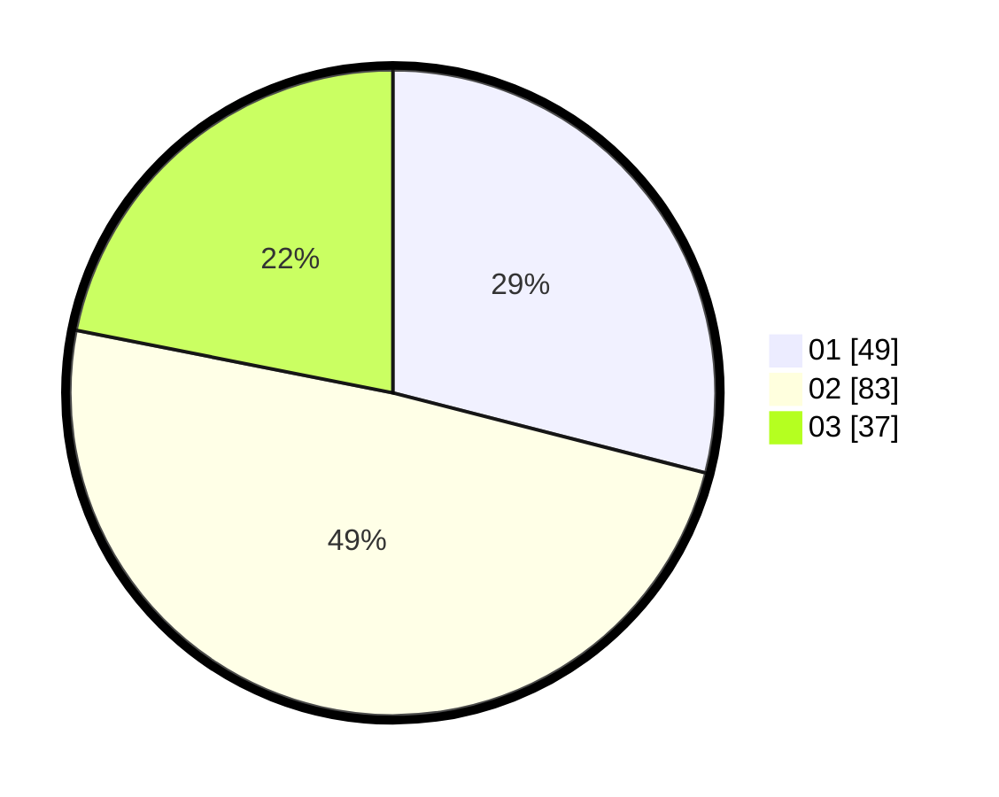

# Hasil

Hasil perolehan suara paslon dapat dilihat pada file paslon-01.txt, paslon-02.txt, dan paslon-03.txt.

Jika tidak ada, artinya data tersebut belum ada pada SIREKAP.

## Perolehan Suara

 * Paslon 01: **49**.
 * Paslon 02: **83**.
 * Paslon 03: **37**.

## Foto C Plano

https://sirekap-obj-formc.kpu.go.id/892a/pemilu/ppwp/31/73/02/10/03/3173021003026-20240216-092002--002931a8-a899-4afa-a9fa-d0873b507b03.jpg

https://sirekap-obj-formc.kpu.go.id/892a/pemilu/ppwp/31/73/02/10/03/3173021003026-20240216-092012--88887ae2-d851-469e-bdca-de78f0744d2e.jpg

https://sirekap-obj-formc.kpu.go.id/892a/pemilu/ppwp/31/73/02/10/03/3173021003026-20240216-092008--cd7216ca-f3fd-4efb-b273-da4672dfb607.jpg

## DATA PEMILIH TETAP

Jumlah pemilih dalam DPT: **241**.
 * L: **108**.
 * P: **133**.

## DATA PENGGUNA HAK PILIH

Jumlah pengguna hak pilih dalam DPT: **164**.
 * L: **76**.
 * P: **88**.

Jumlah pengguna hak pilih dalam DPTb: **2**.
 * L: **1**.
 * P: **1**.

Jumlah pengguna hak pilih dalam DPK: **4**.
 * L: **2**.
 * P: **2**.

Jumlah pengguna hak pilih: **170**.
 * L: **79**.
 * P: **91**.

## JUMLAH SUARA SAH DAN TIDAK SAH

JUMLAH SELURUH SUARA SAH: **169**.

JUMLAH SUARA TIDAK SAH: **1**.

JUMLAH SELURUH SUARA SAH DAN SUARA TIDAK SAH: **170**.
