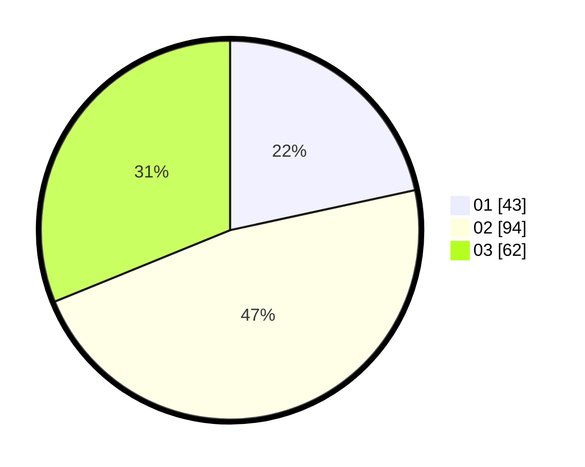

# Hasil

Hasil perolehan suara paslon dapat dilihat pada file paslon-01.txt, paslon-02.txt, dan paslon-03.txt.

Jika tidak ada, artinya data tersebut belum ada pada SIREKAP.

## Perolehan Suara

 * Paslon 01: **43**.
 * Paslon 02: **94**.
 * Paslon 03: **62**.

## Foto C Plano

https://sirekap-obj-formc.kpu.go.id/075e/pemilu/ppwp/31/73/02/10/03/3173021003027-20240215-213909--15519988-be0e-43a3-8dd0-d713e2dc15a1.jpg

https://sirekap-obj-formc.kpu.go.id/075e/pemilu/ppwp/31/73/02/10/03/3173021003027-20240215-213910--f69b748d-8e47-4c9c-8160-c151cececb05.jpg

https://sirekap-obj-formc.kpu.go.id/075e/pemilu/ppwp/31/73/02/10/03/3173021003027-20240215-213909--de501bf7-62cb-4181-a685-7d77203b40c1.jpg

## DATA PEMILIH TETAP

Jumlah pemilih dalam DPT: **242**.
 * L: **123**.
 * P: **119**.

## DATA PENGGUNA HAK PILIH

Jumlah pengguna hak pilih dalam DPT: **187**.
 * L: **94**.
 * P: **93**.

Jumlah pengguna hak pilih dalam DPTb: **13**.
 * L: **3**.
 * P: **10**.

Jumlah pengguna hak pilih dalam DPK: **0**.
 * L: **0**.
 * P: **0**.

Jumlah pengguna hak pilih: **200**.
 * L: **97**.
 * P: **103**.

## JUMLAH SUARA SAH DAN TIDAK SAH

JUMLAH SELURUH SUARA SAH: **199**.

JUMLAH SUARA TIDAK SAH: **1**.

JUMLAH SELURUH SUARA SAH DAN SUARA TIDAK SAH: **200**.
