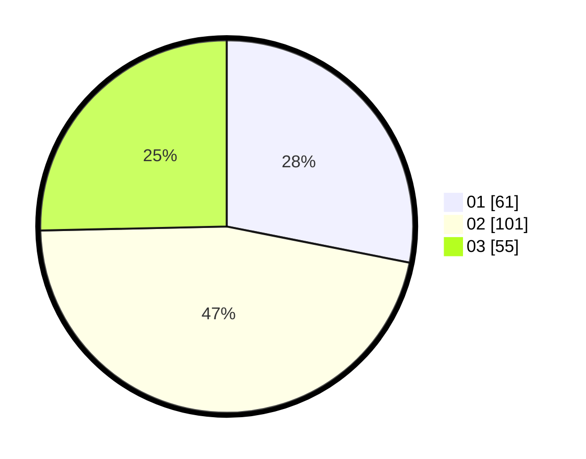

# Hasil

Hasil perolehan suara paslon dapat dilihat pada file paslon-01.txt, paslon-02.txt, dan paslon-03.txt.

Jika tidak ada, artinya data tersebut belum ada pada SIREKAP.

## Perolehan Suara

 * Paslon 01: **61**.
 * Paslon 02: **101**.
 * Paslon 03: **55**.

## Foto C Plano

https://sirekap-obj-formc.kpu.go.id/c6ab/pemilu/ppwp/31/73/02/10/03/3173021003029-20240216-144239--2e80dc1e-cf07-4237-a355-16b54b4e222e.jpg

https://sirekap-obj-formc.kpu.go.id/c6ab/pemilu/ppwp/31/73/02/10/03/3173021003029-20240216-144240--8a60caae-f732-4c03-8c38-4382bd14d1fa.jpg

https://sirekap-obj-formc.kpu.go.id/c6ab/pemilu/ppwp/31/73/02/10/03/3173021003029-20240216-144239--f85c6624-95e1-457e-b06e-cd51a259836f.jpg

## DATA PEMILIH TETAP

Jumlah pemilih dalam DPT: **270**.
 * L: **131**.
 * P: **139**.

## DATA PENGGUNA HAK PILIH

Jumlah pengguna hak pilih dalam DPT: **211**.
 * L: **106**.
 * P: **105**.

Jumlah pengguna hak pilih dalam DPTb: **8**.
 * L: **4**.
 * P: **4**.

Jumlah pengguna hak pilih dalam DPK: **1**.
 * L: **0**.
 * P: **1**.

Jumlah pengguna hak pilih: **220**.
 * L: **110**.
 * P: **110**.

## JUMLAH SUARA SAH DAN TIDAK SAH

JUMLAH SELURUH SUARA SAH: **217**.

JUMLAH SUARA TIDAK SAH: **3**.

JUMLAH SELURUH SUARA SAH DAN SUARA TIDAK SAH: **220**.
