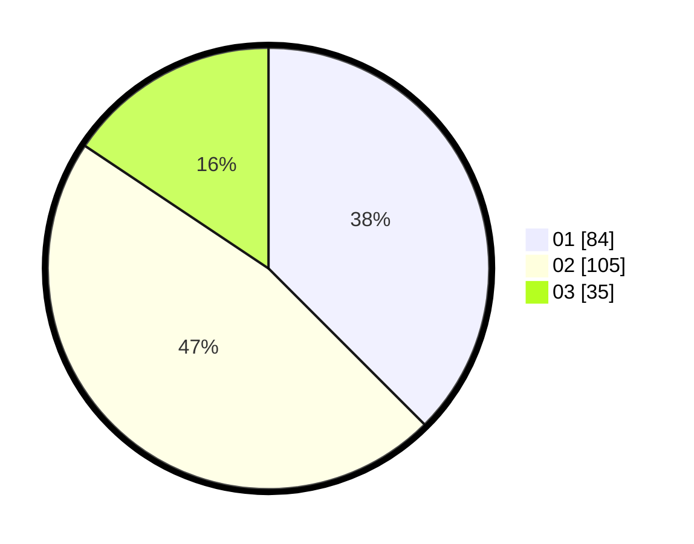

# Hasil

Hasil perolehan suara paslon dapat dilihat pada file paslon-01.txt, paslon-02.txt, dan paslon-03.txt.

Jika tidak ada, artinya data tersebut belum ada pada SIREKAP.

## Perolehan Suara

 * Paslon 01: **84**.
 * Paslon 02: **105**.
 * Paslon 03: **35**.

## Foto C Plano

https://sirekap-obj-formc.kpu.go.id/e216/pemilu/ppwp/31/73/02/10/03/3173021003030-20240215-123744--306906ad-f0c0-4be1-bf01-67a9f29165a1.jpg

https://sirekap-obj-formc.kpu.go.id/e216/pemilu/ppwp/31/73/02/10/03/3173021003030-20240215-123807--e7afc16c-4d90-4bb8-9b62-bb651640b708.jpg

https://sirekap-obj-formc.kpu.go.id/e216/pemilu/ppwp/31/73/02/10/03/3173021003030-20240215-123815--d8605b7e-d6a5-4ab2-9e91-fd231d4cbbc4.jpg

## DATA PEMILIH TETAP

Jumlah pemilih dalam DPT: **277**.
 * L: **143**.
 * P: **134**.

## DATA PENGGUNA HAK PILIH

Jumlah pengguna hak pilih dalam DPT: **216**.
 * L: **110**.
 * P: **106**.

Jumlah pengguna hak pilih dalam DPTb: **10**.
 * L: **3**.
 * P: **7**.

Jumlah pengguna hak pilih dalam DPK: **0**.
 * L: **0**.
 * P: **0**.

Jumlah pengguna hak pilih: **226**.
 * L: **113**.
 * P: **113**.

## JUMLAH SUARA SAH DAN TIDAK SAH

JUMLAH SELURUH SUARA SAH: **224**.

JUMLAH SUARA TIDAK SAH: **2**.

JUMLAH SELURUH SUARA SAH DAN SUARA TIDAK SAH: **226**.
