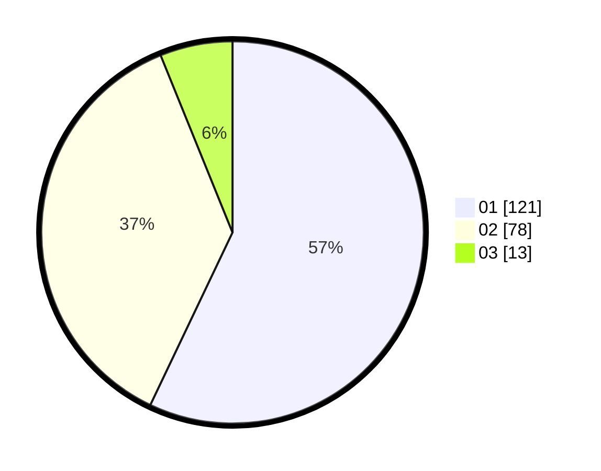

# Hasil

Hasil perolehan suara paslon dapat dilihat pada file paslon-01.txt, paslon-02.txt, dan paslon-03.txt.

Jika tidak ada, artinya data tersebut belum ada pada SIREKAP.

## Perolehan Suara

 * Paslon 01: **121**.
 * Paslon 02: **78**.
 * Paslon 03: **13**.

## Foto C Plano

https://sirekap-obj-formc.kpu.go.id/75c6/pemilu/ppwp/31/73/02/10/03/3173021003034-20240215-220513--e639bbdf-c4ec-4350-abe9-d643ff8eeeb4.jpg

https://sirekap-obj-formc.kpu.go.id/75c6/pemilu/ppwp/31/73/02/10/03/3173021003034-20240215-220516--6c39d23c-5a76-4034-a913-bf9276eae899.jpg

https://sirekap-obj-formc.kpu.go.id/75c6/pemilu/ppwp/31/73/02/10/03/3173021003034-20240215-220515--91aee9f8-7993-459b-85ef-3dcb35b681cf.jpg

## DATA PEMILIH TETAP

Jumlah pemilih dalam DPT: **266**.
 * L: **124**.
 * P: **142**.

## DATA PENGGUNA HAK PILIH

Jumlah pengguna hak pilih dalam DPT: **207**.
 * L: **95**.
 * P: **112**.

Jumlah pengguna hak pilih dalam DPTb: **3**.
 * L: **1**.
 * P: **2**.

Jumlah pengguna hak pilih dalam DPK: **4**.
 * L: **2**.
 * P: **2**.

Jumlah pengguna hak pilih: **214**.
 * L: **98**.
 * P: **116**.

## JUMLAH SUARA SAH DAN TIDAK SAH

JUMLAH SELURUH SUARA SAH: **212**.

JUMLAH SUARA TIDAK SAH: **2**.

JUMLAH SELURUH SUARA SAH DAN SUARA TIDAK SAH: **214**.
