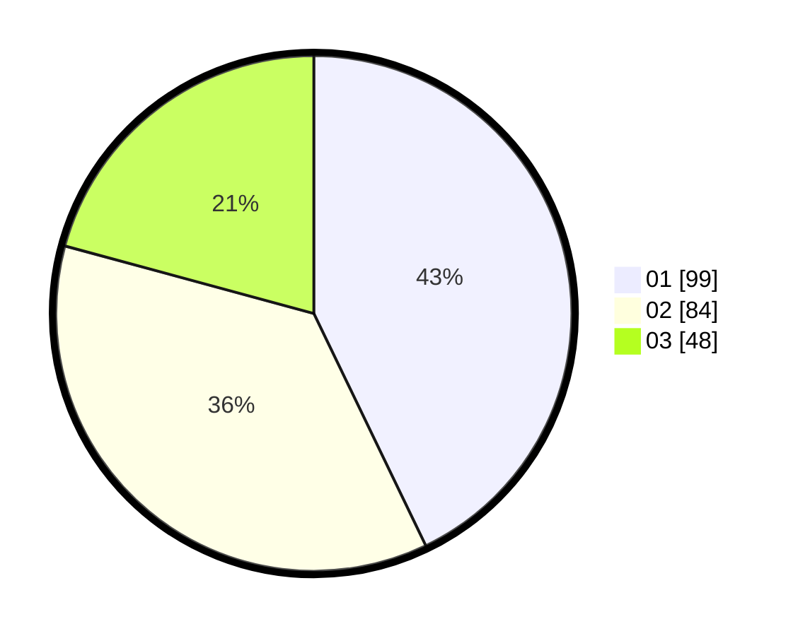

# Hasil

Hasil perolehan suara paslon dapat dilihat pada file paslon-01.txt, paslon-02.txt, dan paslon-03.txt.

Jika tidak ada, artinya data tersebut belum ada pada SIREKAP.

## Perolehan Suara

 * Paslon 01: **99**.
 * Paslon 02: **84**.
 * Paslon 03: **48**.

## Foto C Plano

https://sirekap-obj-formc.kpu.go.id/d299/pemilu/ppwp/31/73/02/10/03/3173021003039-20240215-035651--eaafbd09-06c8-4275-a135-141616c71a07.jpg

https://sirekap-obj-formc.kpu.go.id/d299/pemilu/ppwp/31/73/02/10/03/3173021003039-20240215-035943--3cd53142-c07f-41ac-b2a1-b296d3d1d393.jpg

https://sirekap-obj-formc.kpu.go.id/d299/pemilu/ppwp/31/73/02/10/03/3173021003039-20240215-040043--1816ccee-a7cc-4ab7-b556-ea4bc42841fa.jpg

## DATA PEMILIH TETAP

Jumlah pemilih dalam DPT: **273**.
 * L: **140**.
 * P: **133**.

## DATA PENGGUNA HAK PILIH

Jumlah pengguna hak pilih dalam DPT: **214**.
 * L: **114**.
 * P: **100**.

Jumlah pengguna hak pilih dalam DPTb: **14**.
 * L: **5**.
 * P: **9**.

Jumlah pengguna hak pilih dalam DPK: **6**.
 * L: **4**.
 * P: **2**.

Jumlah pengguna hak pilih: **234**.
 * L: **123**.
 * P: **111**.

## JUMLAH SUARA SAH DAN TIDAK SAH

JUMLAH SELURUH SUARA SAH: **231**.

JUMLAH SUARA TIDAK SAH: **3**.

JUMLAH SELURUH SUARA SAH DAN SUARA TIDAK SAH: **234**.
