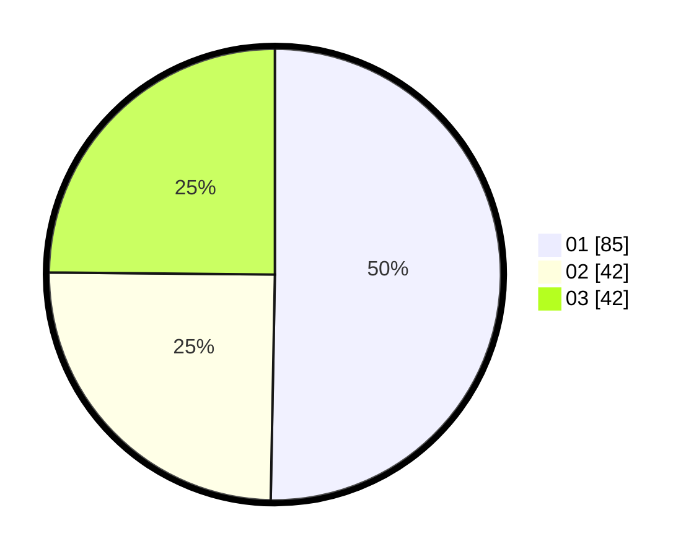

# Hasil

Hasil perolehan suara paslon dapat dilihat pada file paslon-01.txt, paslon-02.txt, dan paslon-03.txt.

Jika tidak ada, artinya data tersebut belum ada pada SIREKAP.

## Perolehan Suara

 * Paslon 01: **85**.
 * Paslon 02: **42**.
 * Paslon 03: **42**.

## Foto C Plano

https://sirekap-obj-formc.kpu.go.id/1361/pemilu/ppwp/31/73/02/10/03/3173021003043-20240216-143730--d636878f-2d8d-4fb4-a8ce-f619e8e1ad07.jpg

https://sirekap-obj-formc.kpu.go.id/1361/pemilu/ppwp/31/73/02/10/03/3173021003043-20240216-143732--17de0fe4-6a33-4783-8c5c-4f6b800a5348.jpg

https://sirekap-obj-formc.kpu.go.id/1361/pemilu/ppwp/31/73/02/10/03/3173021003043-20240216-143731--e0aa1e33-af24-4e20-afee-9c4213d310ce.jpg

## DATA PEMILIH TETAP

Jumlah pemilih dalam DPT: **221**.
 * L: **104**.
 * P: **117**.

## DATA PENGGUNA HAK PILIH

Jumlah pengguna hak pilih dalam DPT: **172**.
 * L: **80**.
 * P: **92**.

Jumlah pengguna hak pilih dalam DPTb: **3**.
 * L: **1**.
 * P: **2**.

Jumlah pengguna hak pilih dalam DPK: **1**.
 * L: **0**.
 * P: **1**.

Jumlah pengguna hak pilih: **176**.
 * L: **81**.
 * P: **95**.

## JUMLAH SUARA SAH DAN TIDAK SAH

JUMLAH SELURUH SUARA SAH: **169**.

JUMLAH SUARA TIDAK SAH: **7**.

JUMLAH SELURUH SUARA SAH DAN SUARA TIDAK SAH: **176**.
