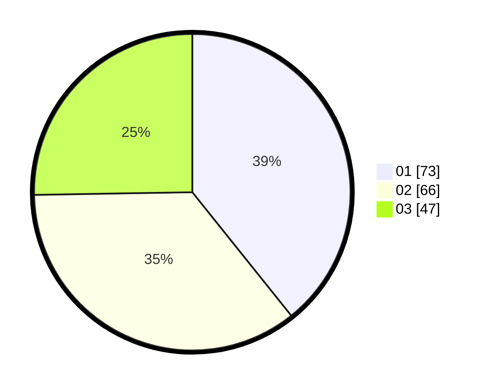

# Hasil

Hasil perolehan suara paslon dapat dilihat pada file paslon-01.txt, paslon-02.txt, dan paslon-03.txt.

Jika tidak ada, artinya data tersebut belum ada pada SIREKAP.

## Perolehan Suara

 * Paslon 01: **73**.
 * Paslon 02: **66**.
 * Paslon 03: **47**.

## Foto C Plano

https://sirekap-obj-formc.kpu.go.id/8de6/pemilu/ppwp/31/73/02/10/03/3173021003045-20240214-225901--13472e38-7a07-452e-90f5-6be41609c2db.jpg

https://sirekap-obj-formc.kpu.go.id/8de6/pemilu/ppwp/31/73/02/10/03/3173021003045-20240214-230033--7dc85212-ed57-4724-a855-c51d43ae2515.jpg

https://sirekap-obj-formc.kpu.go.id/8de6/pemilu/ppwp/31/73/02/10/03/3173021003045-20240214-230059--2a4fce8f-b0d5-4cce-b61c-1a13086fb480.jpg

## DATA PEMILIH TETAP

Jumlah pemilih dalam DPT: **251**.
 * L: **117**.
 * P: **134**.

## DATA PENGGUNA HAK PILIH

Jumlah pengguna hak pilih dalam DPT: **190**.
 * L: **91**.
 * P: **99**.

Jumlah pengguna hak pilih dalam DPTb: **3**.
 * L: **0**.
 * P: **3**.

Jumlah pengguna hak pilih dalam DPK: **0**.
 * L: **0**.
 * P: **0**.

Jumlah pengguna hak pilih: **193**.
 * L: **91**.
 * P: **102**.

## JUMLAH SUARA SAH DAN TIDAK SAH

JUMLAH SELURUH SUARA SAH: **186**.

JUMLAH SUARA TIDAK SAH: **7**.

JUMLAH SELURUH SUARA SAH DAN SUARA TIDAK SAH: **193**.
