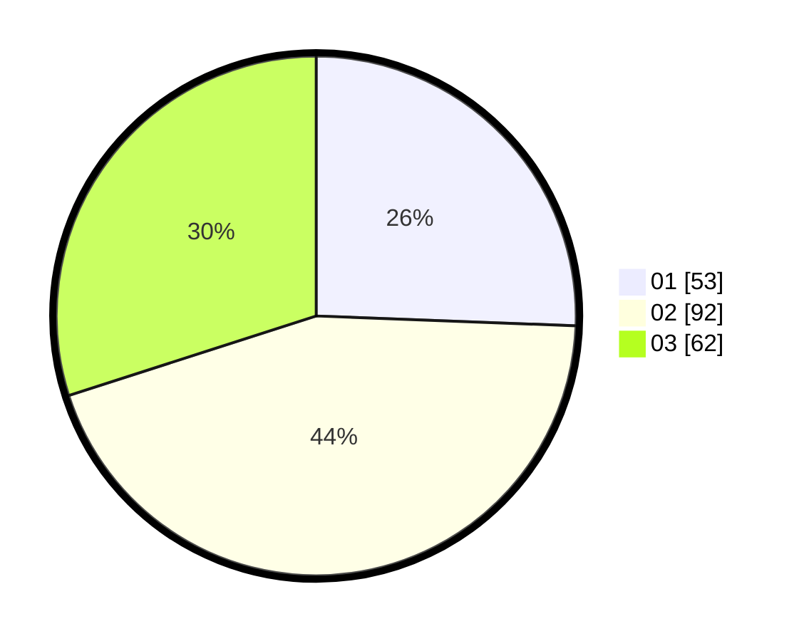

# Hasil

Hasil perolehan suara paslon dapat dilihat pada file paslon-01.txt, paslon-02.txt, dan paslon-03.txt.

Jika tidak ada, artinya data tersebut belum ada pada SIREKAP.

## Perolehan Suara

 * Paslon 01: **53**.
 * Paslon 02: **92**.
 * Paslon 03: **62**.

## Foto C Plano

https://sirekap-obj-formc.kpu.go.id/1279/pemilu/ppwp/31/73/02/10/03/3173021003047-20240214-214516--ed670180-64f9-44c4-a276-f86ecffd6633.jpg

https://sirekap-obj-formc.kpu.go.id/1279/pemilu/ppwp/31/73/02/10/03/3173021003047-20240214-214530--739a34b3-db3b-4e48-8885-5c01a0ae782e.jpg

https://sirekap-obj-formc.kpu.go.id/1279/pemilu/ppwp/31/73/02/10/03/3173021003047-20240215-041541--53a1233a-a518-4832-9b0a-15a1b0d2a4a3.jpg
