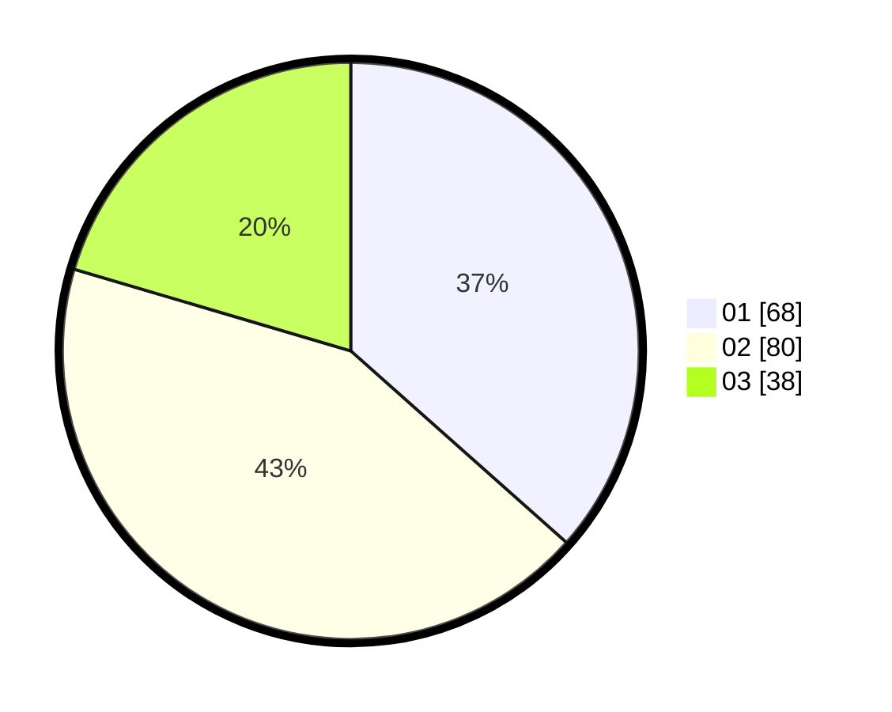

# Hasil

Hasil perolehan suara paslon dapat dilihat pada file paslon-01.txt, paslon-02.txt, dan paslon-03.txt.

Jika tidak ada, artinya data tersebut belum ada pada SIREKAP.

## Perolehan Suara

 * Paslon 01: **68**.
 * Paslon 02: **80**.
 * Paslon 03: **38**.

## Foto C Plano

https://sirekap-obj-formc.kpu.go.id/5ff2/pemilu/ppwp/31/73/02/10/03/3173021003048-20240216-064041--1c3cf913-d26a-4d5f-9ba1-590f2c405a2a.jpg

https://sirekap-obj-formc.kpu.go.id/5ff2/pemilu/ppwp/31/73/02/10/03/3173021003048-20240216-064044--e9e23884-23dd-4865-98e2-0c8e86c39f5d.jpg

https://sirekap-obj-formc.kpu.go.id/5ff2/pemilu/ppwp/31/73/02/10/03/3173021003048-20240216-064042--b5c36417-4e53-45cb-b571-82953375e6e1.jpg

## DATA PEMILIH TETAP

Jumlah pemilih dalam DPT: **232**.
 * L: **125**.
 * P: **107**.

## DATA PENGGUNA HAK PILIH

Jumlah pengguna hak pilih dalam DPT: **180**.
 * L: **94**.
 * P: **86**.

Jumlah pengguna hak pilih dalam DPTb: **3**.
 * L: **1**.
 * P: **2**.

Jumlah pengguna hak pilih dalam DPK: **3**.
 * L: **2**.
 * P: **1**.

Jumlah pengguna hak pilih: **186**.
 * L: **97**.
 * P: **89**.

## JUMLAH SUARA SAH DAN TIDAK SAH

JUMLAH SELURUH SUARA SAH: **186**.

JUMLAH SUARA TIDAK SAH: **0**.

JUMLAH SELURUH SUARA SAH DAN SUARA TIDAK SAH: **186**.
